# MendCode

The customizable coding terminal.

[](https://github.com/MendCode/MendCode/releases)
[](LICENSE)
[](https://www.mendcode.dev/)
[](docs/README.md)
[](CONTRIBUTING.md)

MendCode is a terminal-first coding-agent harness you can make your own: a
public `mendcode` CLI, configurable model roles, review gates, Changes Review,
Memory Center, Plan Mode Markdown, Agent View, reusable team packages, project MCP config,
Herdr/mflow/worktree coordination, Usage Insights, release/security gates, and a
customizable TUI for home identity, prompt chrome, widgets, panels, dialogs, and
themes without patching runtime internals.

[Website](https://www.mendcode.dev/) · [Docs](docs/README.md) · [Feature map](docs/features.md) · [Acknowledgements](ACKNOWLEDGEMENTS.md)

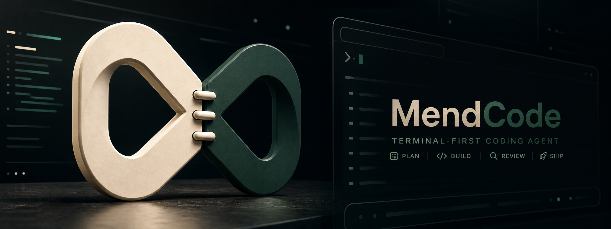

## Contents

- [Why It Exists](#why-it-exists)
- [Install](#install)
- [First Run](#first-run)
- [Product Surfaces](#product-surfaces)
- [Documentation Map](#documentation-map)
- [Development](#development)
- [Community And Security](#community-and-security)
- [Star History](#star-history)
- [For Agents](#for-agents)
- [Lineage](#lineage)

## Why It Exists

Most coding agents give you a chat box. MendCode gives you the harness around it:

| Need | MendCode surface |
| --- | --- |
| Make the terminal feel like your workflow | TUI profiles for prompt chrome, marker, status row, home identity, split home, Agent View, chat presentation, widgets, routes, dialogs, and themes. |
| Share a tuned setup with a team | Runtime packages for commands, agents, modes, skills, prompts, MCP config, plugins, TUI profile, model roles, permissions, memory defaults, and worktree policy. |
| Review before implementation | Plan Mode renders Markdown, including Mermaid when supported, inside a TUI review modal before switching to the implementation agent. |
| Review current code changes | `/changes` opens a responsive TUI diff workspace with comments and agent-visible review context between model turns. |
| Keep repeat work moving | Loop Workflows create durable, monitorable agent loops with safe report-only wakeups, Agent View sessions, and optional per-project OS services. |
| Keep risky actions explicit | Permission modes, smart permission review, preview-first worktree actions, and approval-gated memory proposals. |
| Route work to the right model | Model roles for planning, building, review, subagents, summaries, compaction, memory extraction, Dream, memory side chat, and permission review. |
| Coordinate parallel terminal work | Optional mflow locks plus optional TSM/worktree orchestration for multi-session work. |
| See local activity without cloud analytics | Usage Insights for tokens, sessions, AI time, prompt volume, changed files, top tools, top agents, top models, cache mix, daily activity, and selected-day details. |

The short version: MendCode is not just "run a model in a terminal." It is a
configurable coding terminal with packaging, review, memory, permissions, and
coordination built into the workflow.

## Install

Choose the row for your shell:

| Platform | Command |
| --- | --- |
| macOS / Linux | `curl -fsSL https://raw.githubusercontent.com/MendCode/MendCode/main/src/mendcode/install \| bash && mendcode` |
| Windows PowerShell | `irm https://raw.githubusercontent.com/MendCode/MendCode/main/src/mendcode/install.ps1 \| iex; mendcode` |
| Windows Git Bash / MSYS2 / Cygwin / WSL | `curl -fsSL https://raw.githubusercontent.com/MendCode/MendCode/main/src/mendcode/install \| bash && mendcode` |
| Pin a release | `curl -fsSL https://raw.githubusercontent.com/MendCode/MendCode/main/src/mendcode/install \| bash -s -- --version <version>` |
| No shell startup edits | `curl -fsSL https://raw.githubusercontent.com/MendCode/MendCode/main/src/mendcode/install \| bash -s -- --no-modify-path && ~/.mendcode/bin/mendcode` |

The public command is `mendcode`. Development checkouts may contain a local
`mend` shim for legacy/internal workflows, but public docs, examples, and
screenshots should use `mendcode`.

## First Run

After installation, open MendCode in your repo:

```bash
mendcode
```

On first launch, MendCode opens the setup screen. Use it to configure the
harness once: provider/auth, model roles, budget posture, package state, TUI
profile, prompt mode, memory, and permissions. After that, daily use is just:

```bash
mendcode
```

Useful commands after setup:

| Command | Use it when |
| --- | --- |
| `mendcode run "review this repo and draft a plan"` | You want to open MendCode with an initial task ready. |
| `mendcode chat "summarize current status"` | You want a quick control-plane turn without entering the full TUI. |
| `mendcode status` / `mendcode doctor` | You want readiness or diagnostics. |
| `mendcode setup status` | You want to inspect setup state after the guided setup screen. |
| `mendcode packages status` | You want to inspect active team/runtime packages. |
| `mendcode mflow status` | You are coordinating multiple agents around the same repo. |
| `mendcode --worktree feature-branch` | You want to open MendCode against a branch/path/id worktree target. |
| `mendcode --tsm feature-branch` | You want a TSM workspace with a MendCode split. |

## Product Surfaces

### Custom Terminal UI

MendCode turns the terminal into a configurable product surface: home identity,
prompt frame, prompt marker, status row, split panels, Agent View, action
menus, chat presentation, widgets, slots, custom routes, dialogs, footer
entries, and themes.

<table>
<tr>
<td colspan="2"><strong>Choose the home identity</strong></td>
</tr>
<tr>
<td valign="top" width="50%">
<details open>
<summary><strong>Option A: wordmark welcome</strong></summary>
<p>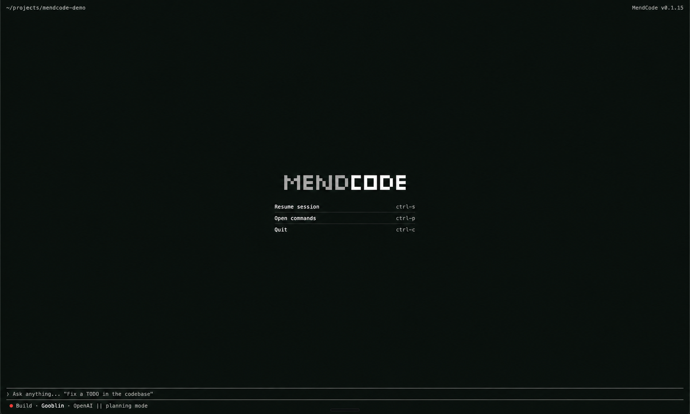</p>
</details>
</td>
<td valign="top" width="50%">
<details open>
<summary><strong>Option B: mascot welcome</strong></summary>
<p>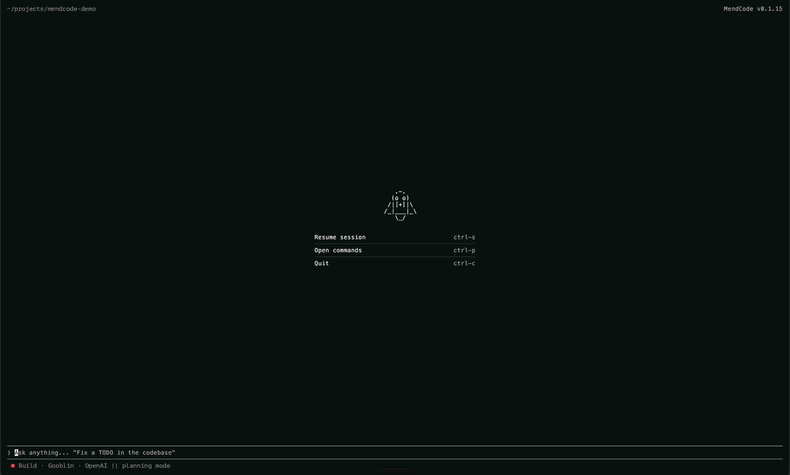</p>
</details>
</td>
</tr>
</table>

<br>

<table>
<tr>
<td colspan="2"><strong>Choose the working layout</strong></td>
</tr>
<tr>
<td valign="top" width="50%">
<details open>
<summary><strong>Option A: wordmark with Agent View</strong></summary>
<p>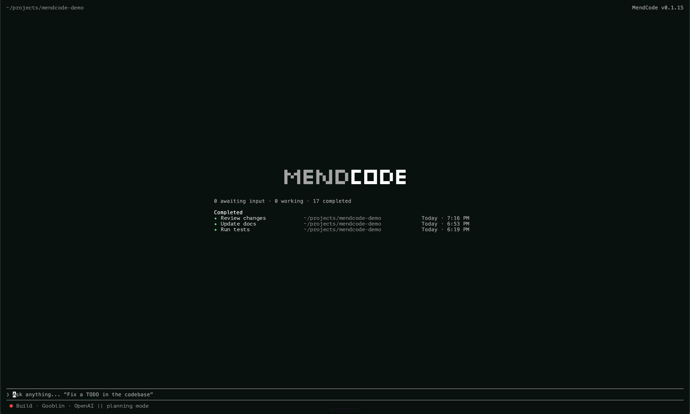</p>
</details>
</td>
<td valign="top" width="50%">
<details open>
<summary><strong>Option B: mascot with Agent View</strong></summary>
<p>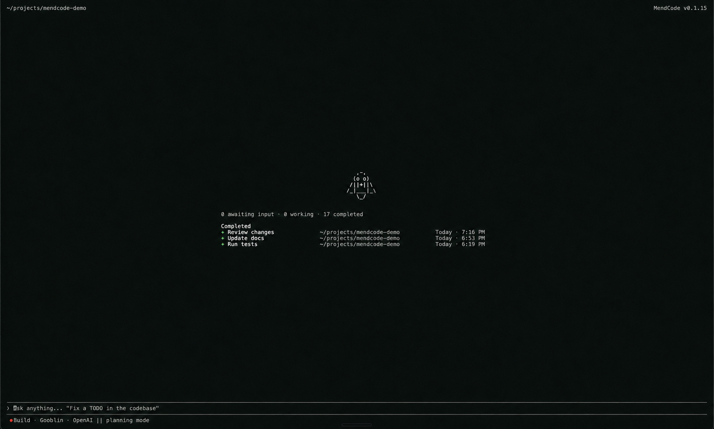</p>
</details>
</td>
</tr>
</table>

<br>

<table>
<tr>
<td colspan="2"><strong>Choose the action surface</strong></td>
</tr>
<tr>
<td valign="top" width="50%">
<details open>
<summary><strong>Option A: wordmark actions</strong></summary>
<p>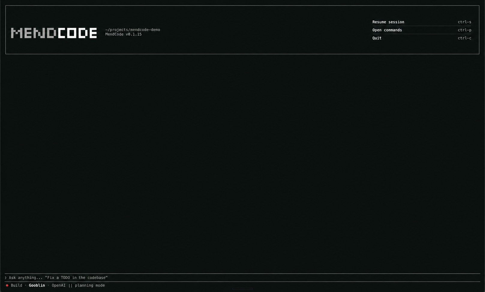</p>
</details>
</td>
<td valign="top" width="50%">
<details open>
<summary><strong>Option B: mascot actions</strong></summary>
<p>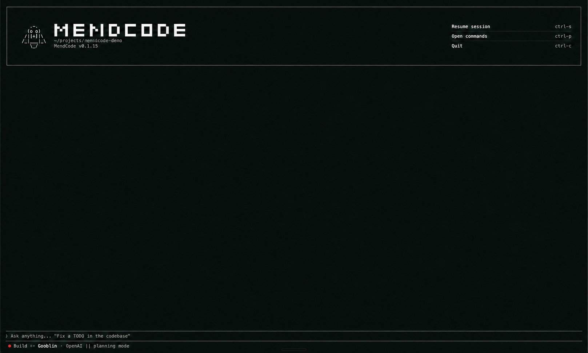</p>
</details>
</td>
</tr>
</table>

<br>

<table>
<tr>
<td colspan="2"><strong>Configure the terminal profile</strong></td>
</tr>
<tr>
<td valign="top" width="50%">
<details open>
<summary><strong>Example profile JSON</strong></summary>
<pre><code class="language-jsonc">{
  "identity": {
    "logoMode": "mascot",
    "productName": "MendCode"
  },
  "surfaces": {
    "homeWelcome": {
      "mode": "split",
      "rightPanel": "agentManager"
    }
  },
  "promptChrome": {
    "preset": "top-bottom",
    "glyphs": {
      "leadText": "mendcode&gt;"
    }
  },
  "promptStatus": {
    "placementByPreset": {
      "top-bottom": "outside",
      "ascii-box": "inside"
    }
  }
}</code></pre>
</details>
</td>
<td valign="top" width="50%">
<details open>
<summary><strong>Command palette entries</strong></summary>
<pre><code>Ctrl+P -> Home identity
Ctrl+P -> Home welcome mode
Ctrl+P -> Home split panel
Ctrl+P -> Prompt chrome
Ctrl+P -> Prompt lead string
Ctrl+P -> Prompt status placement
Ctrl+P -> Chat presentation
Ctrl+P -> Usage Insights</code></pre>
</details>
</td>
</tr>
</table>

<br>

<table>
<tr>
<td colspan="2"><strong>Agent View as a first-class terminal surface</strong></td>
</tr>
<tr>
<td valign="top" width="50%">
<details open>
<summary><strong>Full Agent View</strong></summary>
<p>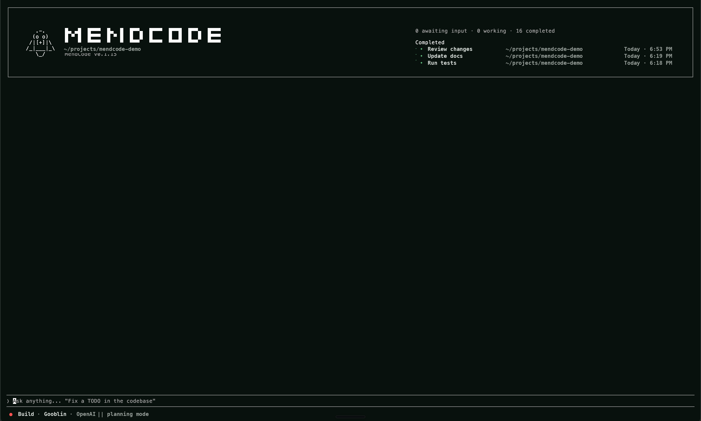</p>
</details>
</td>
<td valign="top" width="50%">
<details open>
<summary><strong>What can be themed</strong></summary>
<p>Home layout, title identity, mascot mode, prompt frame, prompt lead, status
placement, chat presentation, activity states, widgets, slots, custom routes,
dialogs, footer entries, and theme tokens.</p>
</details>
</td>
</tr>
</table>

### Package Your Harness

A MendCode package captures the reusable parts of a team setup:

```text
.mendcode/
  agents/
  commands/
  modes/
  skills/
  prompts/
  plugins/
  tui/
  widgets/
```

Packages can include MCP config, context docs, scripts, TUI profiles, theme
tokens, model roles, focus defaults, budget posture, permission defaults,
memory defaults, and worktree policy.

Packages must not include provider tokens, OAuth state, `.env*`,
`.mendcode/auth`, local databases, room secrets, or machine-local cache/run
state.

```bash
mendcode packages create --id acme-standard --title "Acme Standard" --include skills,modes,plugins
mendcode packages list
mendcode packages install acme-standard
mendcode packages enable acme-standard
```

### Plan Mode

Plan Mode is for users who want the agent to think first without silently
editing files.

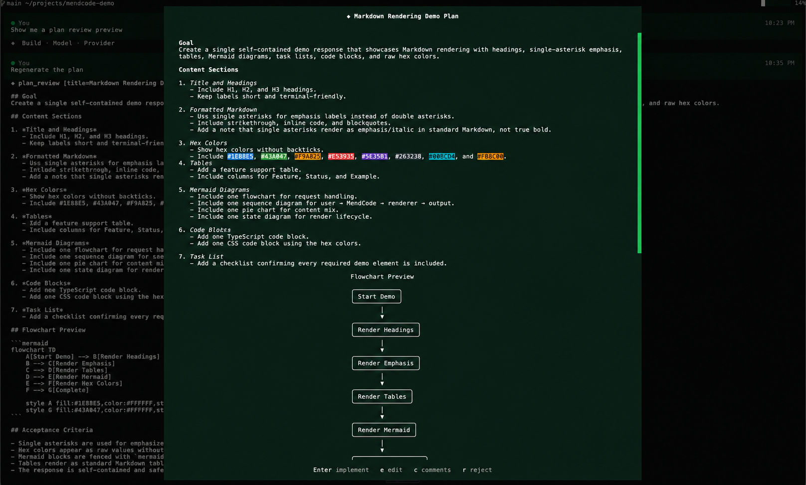

1. The planning agent researches and writes a Markdown plan.
2. MendCode renders the plan in a TUI modal.
3. The user can approve, edit, comment, reject, or close.
4. Approval switches into the configured implementation agent.
5. The reviewed Markdown becomes the source of truth for implementation.

See [Plan Mode](docs/plan-mode.md).

### Changes Review

Changes Review opens the current working-tree diff inside the TUI. It is a
review workspace, not just static patch text: move by file, hunk, or line; add
comments; reload the diff; then press `Esc` or `q` to return to chat without
stopping the active session.

```text
/changes
```

When the view is active, MendCode gives the assistant bounded review context on
model turns: selected file/hunk/line, comments, stale comment count, and compact
file summaries. Comments added while an agent is working become visible to the
agent on the next model turn, including after a tool call completes. MendCode
does not splice new comments into an already-running token stream.

See [Changes Review](docs/changes-review.md).

### Loop Workflows

Loop Workflows are durable, monitorable agent loops for objectives that should
keep moving across controlled iterations. A loop starts as a draft, becomes an
activated root session, records run/journal events, appears in Agent View, and
can be woken manually or by a per-project background service.

```bash
mendcode loops examples
mendcode loops draft --template research-digest --name "Loop test"
mendcode loops activate loop_...
mendcode loops tick loop_... --execute --report-only
mendcode loops monitor loop_...
```

The safe test path is `--execute --report-only`: the agent wakes and writes
transcript activity, but edit/write/patch/shell/subagent tools are denied.
Full execution remains explicit through `--execute` or
`mendcode loops service start --allow-edits`.

See [Loop Workflows](docs/loop-workflows.md).

### Memory With Control

MendCode memory is approval-first by design. It can retrieve useful project
context without turning every session into permanent state.

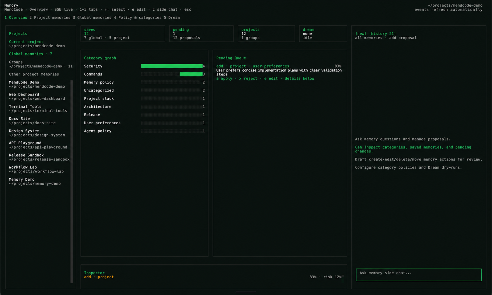

- global and project scopes
- explicit `mendcode memory add`
- `mendcode memory search` and `mendcode memory preview`
- generated memory proposals
- apply, reject, and edit proposal flow
- transient prompt injection through bounded memory context

The Memory Center view brings saved memories, pending proposals, categories,
Dream state, project grouping, and a constrained memory side chat into one
reviewable workspace. See [Memory Center](docs/memory-center.md).

### Usage Insights

Usage Insights is local observability for the coding harness, not cloud
analytics and not a productivity claim.

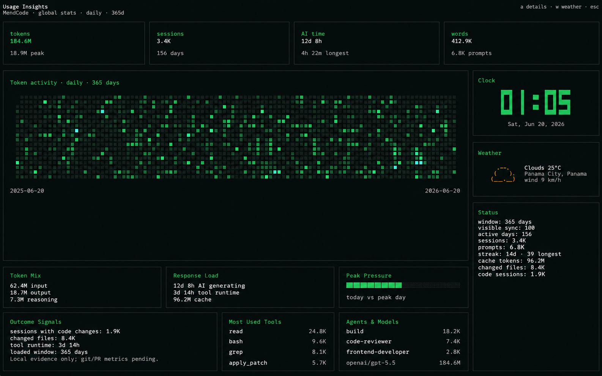

It can show global/project/directory scope, token heatmaps, sessions, active
days, prompt volume, AI generation time, tool runtime, changed files, top tools,
top agents, top models, cache mix, and optional weather.

See [Usage Insights](docs/usage-insights.md).

### Coordination: mflow, TSM, Worktrees

MendCode includes optional coordination for people running multiple terminal
sessions around the same codebase.

| Surface | Purpose |
| --- | --- |
| mflow | Local-first coordination, room activation, daemon status, and edit locks. |
| Worktrees | Preview-first creation, adoption, opening, reset, and removal of git worktrees. |
| TSM | Optional terminal-session workspace setup for MendCode panes. |

```bash
mendcode mflow setup
mendcode worktree plan feature-branch
mendcode worktree create feature-branch
mendcode tsm setup
```

## Documentation Map

| If you want to... | Read |
| --- | --- |
| Understand the whole product surface | [Feature map](docs/features.md) |
| Install, configure, and check readiness | [CLI, setup, and configuration](docs/cli-setup-configuration.md) |
| Shape the visual terminal experience | [Customization](docs/customization.md) |
| Share team packages | [Packages and team sharing](docs/packages-and-team-sharing.md) |
| Extend the TUI with code | [TUI plugins and widgets](docs/tui-plugins-and-widgets.md) |
| Use plan review gates | [Plan Mode](docs/plan-mode.md) |
| Review working-tree changes | [Changes Review](docs/changes-review.md) |
| Run durable agent loops | [Loop Workflows](docs/loop-workflows.md) |
| Inspect local activity | [Usage Insights](docs/usage-insights.md) |
| Coordinate multi-session work | [mflow](docs/mflow.md), [TSM and worktrees](docs/tsm-and-worktrees.md) |
| Understand source layout and ownership | [Architecture](docs/architecture.md) |
| Release safely | [Releasing](docs/releasing.md), [Supply chain security](docs/supply-chain-security.md) |

## Development

This repository contains the MendCode-owned runtime under `src/mendcode/`.
Focused development usually happens in `src/mendcode/packages/opencode`.

Useful commands from an existing checkout:

```bash
cd src/mendcode/packages/opencode
bun test --timeout 30000
bun run typecheck
bun run build
```

The root `src/mendcode` package intentionally does not use `bun test` as the
normal test entrypoint; run focused tests from the package that owns the change.

## Community And Security

- [Contributing](CONTRIBUTING.md): local development, PR expectations, and review flow.
- [Security policy](SECURITY.md): supported reporting path for security issues.
- [Community docs](docs/community.md): issues, discussions, labels, and contribution guidance.
- [Release process](docs/releasing.md): release assets, checksums, installer smoke tests, and public promotion.
- [Supply chain security](docs/supply-chain-security.md): provenance, dependency review, scanners, and release hardening.

## Star History

<a href="https://www.star-history.com/#MendCode/MendCode&Date">
  <picture>
    <source media="(prefers-color-scheme: dark)" srcset="https://api.star-history.com/chart?repos=MendCode/MendCode&type=date&theme=dark&legend=top-left">
    <source media="(prefers-color-scheme: light)" srcset="https://api.star-history.com/chart?repos=MendCode/MendCode&type=date&legend=top-left">
    
  </picture>
</a>

## For Agents

<details>
<summary><strong>Open MendCode repo context for coding agents</strong></summary>

This block is intentionally visible only when expanded in GitHub Markdown. It
exists so coding agents that read the README get MendCode context before editing
docs, website copy, CLI help, screenshots, or public claims. Treat this as
context, then verify live code before changing behavior.

### Public identity

- Product name: MendCode.
- Public command: `mendcode`.
- Local development checkouts may include a legacy `mend` shim. Public docs,
  examples, screenshots, release notes, website copy, and user-facing commands
  should use `mendcode` unless the router contract changes.
- MendCode is a downstream project built on opencode, with attribution in
  [ACKNOWLEDGEMENTS.md](ACKNOWLEDGEMENTS.md). Do not present it as a simple
  rename.

### Public CLI contract

- Source of truth: `src/mendcode/packages/opencode/src/mend/cli/public-bin.ts`.
- Re-run public help before adding command examples.
- Primary public surfaces include opening the TUI, `run`, `chat`, `status`,
  `doctor`, `setup`, `packages`, `mflow`, `worktree`, and `tsm`.
- Support surfaces include `models`, `providers`, `auth`, `permissions`,
  `memory`, and `focus`.
- Internal debug surfaces such as `adapter`, `ai`, `bench`, `budget`, `config`,
  `context`, `export`, `mcp`, `prompt`, `prompts`, `runtime`, `toolchain`,
  `tui`, and `upstream` should not be marketed as normal user workflows.

### Core product story

- MendCode is the customizable coding terminal: CLI, TUI, setup flow, model
  roles, permission policy, memory, runtime packages, Plan Mode, Usage Insights,
  optional mflow coordination, optional TSM and worktree orchestration, widgets,
  plugins, and TUI profiles.
- The pitch is not another chat prompt. The pitch is a configurable harness:
  prompt chrome, status rows, model roles, memory policy, team packages,
  workflow coordination, review gates, and local observability.

### TUI customization

- Main user-facing docs: [Customization](docs/customization.md) and
  [TUI plugins and widgets](docs/tui-plugins-and-widgets.md).
- Profile path: `.mendcode/tui/profile.json`.
- Key surfaces: prompt frame, prompt lead string, prompt status row, home title,
  mascot mode, centered home, split home, Agent View, chat presentation,
  activity states, widgets, slots, custom routes, dialogs, footer entries,
  themes, density, and package-distributed UI behavior.
- Good demo profile: mascot identity, split home, `agentManager` right panel,
  `top-bottom` prompt chrome, `mendcode>` lead text, and outside prompt status.

### Packages

- Main docs: [Packages and team sharing](docs/packages-and-team-sharing.md).
- Packages can include commands, agents, modes, skills, prompts, MCP config,
  context docs, scripts, plugins, widgets, components, TUI profile, themes,
  model roles, focus defaults, budget posture, permission defaults, memory
  defaults, and worktree policy.
- Packages must not include provider tokens, OAuth state, `.env*`, auth state,
  local databases, room secrets, or machine-local run/cache state.

### Review, memory, and safety

- Plan Mode is an explicit review gate before implementation.
- Memory is approval-first: global/project scopes, explicit add/search/preview
  flows, generated proposals, and apply/reject/edit review.
- Memory Center is the user-facing memory workspace: saved global/project
  memories, pending proposals, project grouping, category graph, category
  policy, Dream status/logs, inspector, and constrained memory side chat.
- The memory side agent can answer memory-specific questions, inspect saved
  entries/categories/policies, explain why context is being retrieved, and draft
  reviewable proposals for memory/category/policy changes. It should be
  described as powerful for memory stewardship, not as a general coding agent.
- Dream is the manual/scheduled memory maintenance loop. It can consolidate
  stale or duplicated knowledge, surface conflicts, generate safety evidence,
  and create proposals through the `memoryDream` role; it should not be claimed
  to edit source files, mutate git, or apply memory silently.
- Generated memory mutations remain proposals unless the user explicitly applies
  them. This applies to extraction, side chat, and Dream.
- Usage Insights is local observability, not cloud analytics and not a
  productivity guarantee.
- Smart permissions can route risky actions through a configured reviewer role.

### Coordination

- mflow is optional local-first coordination and lock/status support.
- Worktree and TSM flows are optional terminal/worktree orchestration.
- Destructive worktree actions should stay preview-first and gated.

### Documentation map

- [Feature map](docs/features.md): product inventory for README, website,
  screenshots, and demos.
- [Docs index](docs/README.md): user journey index.
- [CLI, setup, and configuration](docs/cli-setup-configuration.md): setup,
  config, models, permissions, and memory.
- [Customization](docs/customization.md): static TUI profile and visual
  customization.
- [TUI plugins and widgets](docs/tui-plugins-and-widgets.md): dynamic TUI
  extension points.
- [Plan Mode](docs/plan-mode.md): plan review flow.
- [Changes Review](docs/changes-review.md): responsive diff review, comments,
  keybinds, and agent-visible review context.
- [Memory Center](docs/memory-center.md): saved/pending memories, categories,
  Dream maintenance, and the constrained memory side agent.
- [Usage Insights](docs/usage-insights.md): local activity dashboard.
- [mflow](docs/mflow.md): local-first coordination.
- [TSM and worktrees](docs/tsm-and-worktrees.md): terminal/worktree orchestration.
- [Architecture](docs/architecture.md): source layout and ownership boundaries.
- [Releasing](docs/releasing.md) and
  [Supply chain security](docs/supply-chain-security.md): release and supply
  chain policy.

### Public copy rules

- Keep docs provider-neutral unless a user explicitly asks for provider-specific
  examples.
- Avoid aspirational feature claims without a source path, validated behavior,
  or clearly marked local work.
- Prefer factual capability wording over behavioral prompt instructions.
- If code contradicts this block, the code wins.

</details>

## Lineage

MendCode is a downstream project built on the opencode codebase. It is not
presented as a simple fork: MendCode adds its own `mendcode` CLI surface,
control plane, setup flow, package system, mflow coordination, optional
TSM/worktree orchestration, Plan Mode review flow, Usage Insights dashboard,
memory policy, model-role projection, and terminal UI customization layer.

See [ACKNOWLEDGEMENTS.md](ACKNOWLEDGEMENTS.md) for attribution.
