<p align="center">
  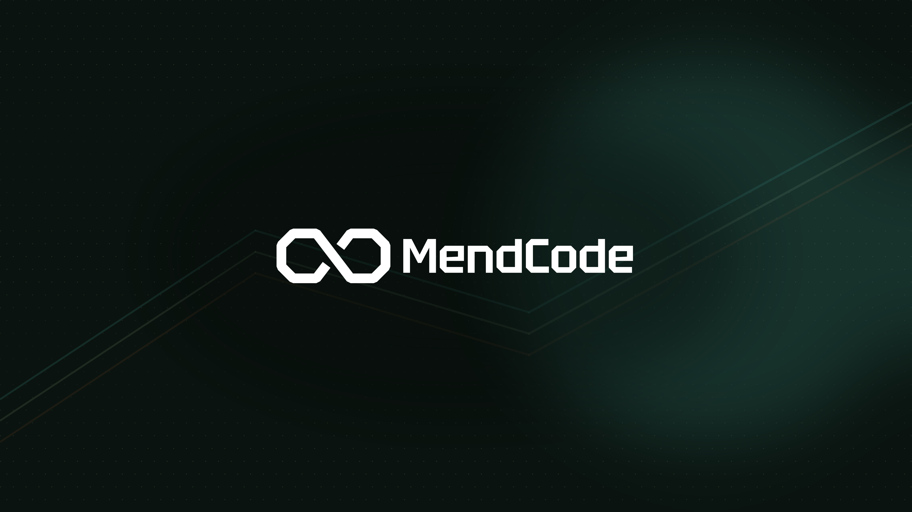
</p>

<p align="center"><strong>The customizable coding terminal.</strong></p>

<p align="center">
  <a href="https://github.com/MendCode/MendCode/releases"></a>
  <a href="LICENSE"></a>
  <a href="https://www.mendcode.dev/"></a>
  <a href="docs/README.md"></a>
  <a href="CONTRIBUTING.md"></a>
</p>

MendCode is a terminal-first coding-agent harness you can make your own: a
public `mendcode` CLI, configurable model roles, review gates, Changes Review,
Memory Center, Plan Mode Markdown, Agent View, reusable team packages, project MCP config,
mflow/worktree coordination, Usage Insights, release/security gates, and a
customizable TUI for home identity, prompt chrome, widgets, panels, dialogs, and
themes without patching runtime internals. Local agents can also control the
same session runtime through versioned JSON commands for progress, waiting, and
cancellation.

<p align="center">
  <a href="https://www.mendcode.dev/">Website</a> ·
  <a href="docs/README.md">Docs</a> ·
  <a href="docs/features.md">Feature map</a> ·
  <a href="ACKNOWLEDGEMENTS.md">Acknowledgements</a>
</p>

## Contents

- [Why It Exists](#why-it-exists)
- [Install](#install)
- [First Run](#first-run)
- [Product Surfaces](#product-surfaces)
- [Documentation Map](#documentation-map)
- [Development](#development)
- [Community And Security](#community-and-security)
- [For Agents](#for-agents)
- [Lineage](#lineage)

## Why It Exists

Most coding agents give you a chat box. MendCode gives you the harness around it:

| Need | MendCode surface |
| --- | --- |
| Make the terminal feel like your workflow | TUI profiles for prompt chrome, marker, status row, home identity, split home, Agent View, chat presentation, widgets, routes, dialogs, and themes. |
| Share a tuned setup with a team | Runtime packages for commands, agents, modes, skills, prompts, MCP config, plugins, TUI profile, model roles, permissions, memory defaults, and worktree policy. |
| Review before implementation | Plan Mode renders Markdown, including Mermaid when supported, inside a TUI review modal before switching to the implementation agent. |
| Review current code changes | `/changes` opens a responsive TUI diff workspace with comments and agent-visible review context between model turns. |
| Keep repeat work moving | Loop Workflows create durable, monitorable loop sessions with contract-aware report-only wakeups, `/loop` creation, `/loops` supervision, and optional per-project OS services. |
| Keep risky actions explicit | Permission modes, smart permission review, preview-first worktree actions, and approval-gated memory proposals. |
| Route work to the right model | Model roles for planning, building, explicit review agents, subagents, summaries, compaction, memory extraction, Dream, memory side chat, and permission review. |
| Let local agents drive real sessions | `mendcode session` and `mendcode run --format json` expose the existing runtime for machine-readable session control, events, waiting, inspection, and cancellation. |
| Coordinate parallel terminal work | Optional mflow locks plus optional TSM/worktree orchestration for multi-session work. |
| See local activity without cloud analytics | Usage Insights for tokens, sessions, AI time, prompt volume, changed files, top tools, top agents, top models, cache mix, daily activity, and selected-day details. |

The short version: MendCode is not just "run a model in a terminal." It is a
configurable coding terminal with packaging, review, memory, permissions, and
coordination built into the workflow.

## Install

Choose the row for your shell:

| Platform | Command |
| --- | --- |
| macOS / Linux | `curl -fsSL https://raw.githubusercontent.com/MendCode/MendCode/main/src/mendcode/install \| bash && mendcode` |
| Windows PowerShell | `irm https://raw.githubusercontent.com/MendCode/MendCode/main/src/mendcode/install.ps1 \| iex; mendcode` |
| Windows CMD (no PowerShell) | `curl.exe -fsSL https://raw.githubusercontent.com/MendCode/MendCode/main/src/mendcode/install.cmd -o "%TEMP%\mendcode-install.cmd" && call "%TEMP%\mendcode-install.cmd"` |
| Windows direct ZIP | [Download the x64 ZIP](https://github.com/MendCode/MendCode/releases/latest/download/mendcode-windows-x64.zip) and run `mendcode.exe` after extracting. |
| Windows Git Bash / MSYS2 / Cygwin / WSL | `curl -fsSL https://raw.githubusercontent.com/MendCode/MendCode/main/src/mendcode/install \| bash && mendcode` |
| Pin a release | `curl -fsSL https://raw.githubusercontent.com/MendCode/MendCode/main/src/mendcode/install \| bash -s -- --version <version>` |
| No shell startup edits | `curl -fsSL https://raw.githubusercontent.com/MendCode/MendCode/main/src/mendcode/install \| bash -s -- --no-modify-path && ~/.mendcode/bin/mendcode` |

The public command is `mendcode`. Development checkouts may contain a local
`mend` shim for legacy/internal workflows, but public docs, examples, and
screenshots should use `mendcode`.

## First Run

After installation, open MendCode in your repo:

```bash
mendcode
```

On first launch, MendCode opens the setup screen. Use it to configure the
harness once: provider/auth, model roles, budget posture, package state, TUI
profile, prompt mode, memory, and permissions. Once setup is complete, use the
commands below for everyday work:

Useful commands after setup:

| Command | Use it when |
| --- | --- |
| `mendcode run "review this repo and draft a plan"` | You want to open MendCode with an initial task ready. |
| `mendcode chat "summarize current status"` | You want a quick control-plane turn without entering the full TUI. |
| `mendcode session list --format json` | Another local agent needs to discover and control MendCode sessions. |
| `mendcode status` / `mendcode doctor` | You want readiness or diagnostics. |
| `mendcode setup status` | You want to inspect setup state after the guided setup screen. |
| `mendcode marketplace status` | You want to inspect active team/runtime marketplace packages. |
| `mendcode install <pack-id>` | You want the short marketplace install path for a package. |
| `mendcode mflow status` | You are coordinating multiple agents around the same repo. |
| `mendcode --worktree feature-branch` | You want to open MendCode against a branch/path/id worktree target. |
| `mendcode --tsm feature-branch` | You want a TSM workspace with a MendCode split. |

## Product Surfaces

### Custom Terminal UI

MendCode turns the terminal into a configurable product surface: home identity,
prompt frame, prompt marker, status row, split panels, Agent View, action
menus, chat presentation, widgets, slots, custom routes, dialogs, footer
entries, and themes.

<table>
<tr>
<td colspan="2"><strong>Choose the home identity</strong></td>
</tr>
<tr>
<td valign="top" width="50%">
<details open>
<summary><strong>Option A: wordmark welcome</strong></summary>
<p>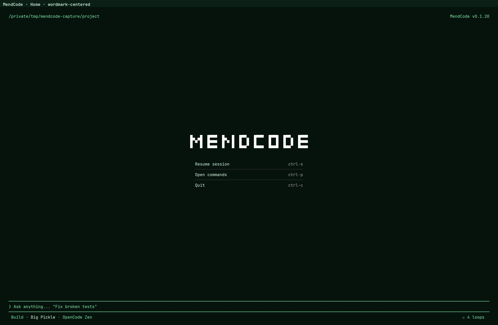</p>
</details>
</td>
<td valign="top" width="50%">
<details open>
<summary><strong>Option B: mascot welcome</strong></summary>
<p>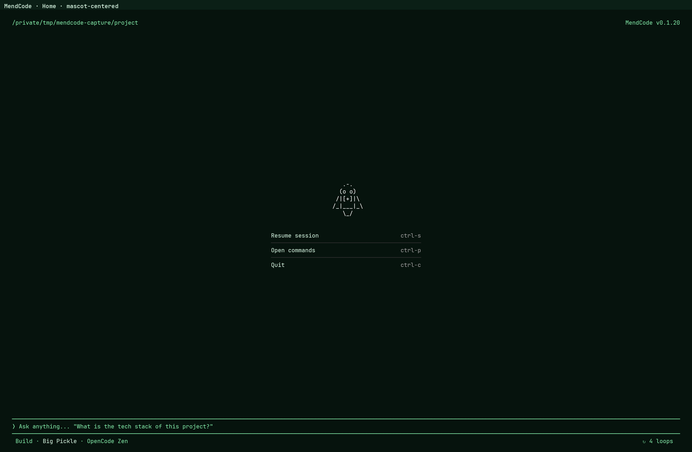</p>
</details>
</td>
</tr>
</table>

<br>

<table>
<tr>
<td colspan="2"><strong>Choose the working layout</strong></td>
</tr>
<tr>
<td valign="top" width="50%">
<details open>
<summary><strong>Option A: wordmark with Agent View</strong></summary>
<p>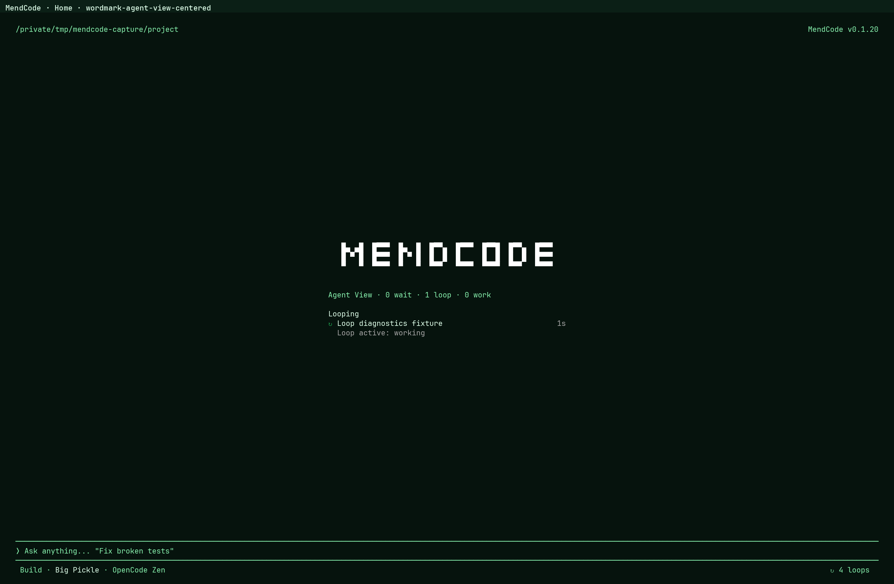</p>
</details>
</td>
<td valign="top" width="50%">
<details open>
<summary><strong>Option B: mascot with Agent View</strong></summary>
<p>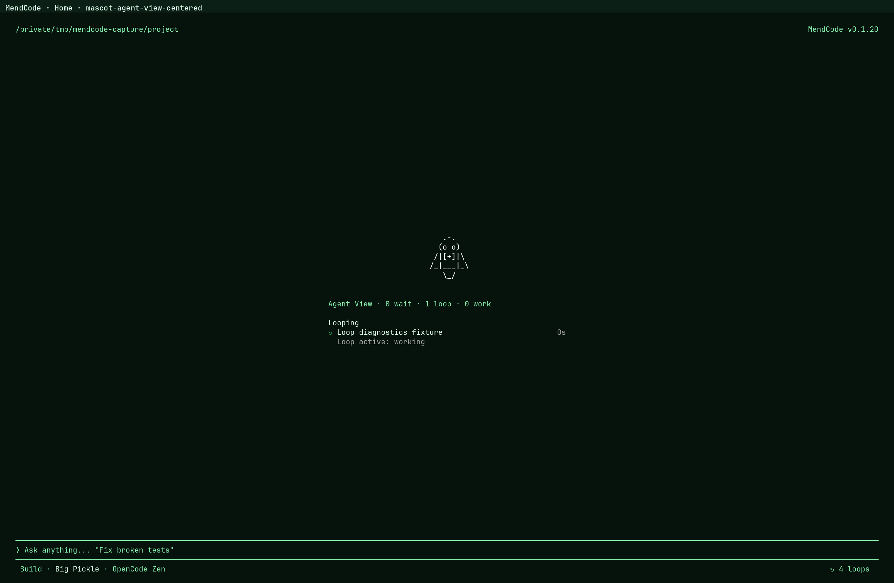</p>
</details>
</td>
</tr>
</table>

<br>

<table>
<tr>
<td colspan="2"><strong>Choose the action surface</strong></td>
</tr>
<tr>
<td valign="top" width="50%">
<details open>
<summary><strong>Option A: wordmark actions</strong></summary>
<p></p>
</details>
</td>
<td valign="top" width="50%">
<details open>
<summary><strong>Option B: mascot actions</strong></summary>
<p>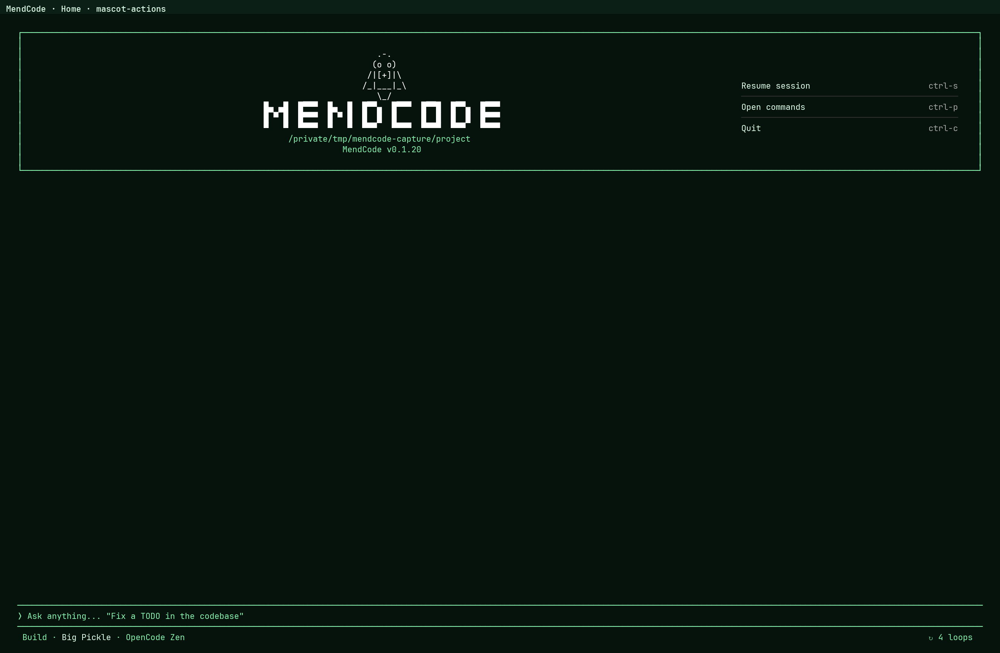</p>
</details>
</td>
</tr>
</table>

<br>

<table>
<tr>
<td colspan="2"><strong>Configure the terminal profile</strong></td>
</tr>
<tr>
<td valign="top" width="50%">
<details open>
<summary><strong>Example profile JSON</strong></summary>
<pre><code class="language-jsonc">{
  "identity": {
    "logoMode": "mascot",
    "productName": "MendCode"
  },
  "surfaces": {
    "homeWelcome": {
      "mode": "split",
      "rightPanel": "agentManager"
    }
  },
  "promptChrome": {
    "preset": "top-bottom",
    "glyphs": {
      "leadText": "mendcode&gt;"
    }
  },
  "promptStatus": {
    "placementByPreset": {
      "top-bottom": "outside",
      "ascii-box": "inside"
    }
  }
}</code></pre>
</details>
</td>
<td valign="top" width="50%">
<details open>
<summary><strong>Command palette entries</strong></summary>
<pre><code>Ctrl+P -> Home identity
Ctrl+P -> Home welcome mode
Ctrl+P -> Home split panel
Ctrl+P -> Prompt chrome
Ctrl+P -> Prompt lead string
Ctrl+P -> Prompt status placement
Ctrl+P -> Chat presentation
Ctrl+P -> Usage Insights</code></pre>
</details>
</td>
</tr>
</table>

<br>

<table>
<tr>
<td colspan="2"><strong>Agent View as a first-class terminal surface</strong></td>
</tr>
<tr>
<td valign="top" width="50%">
<details open>
<summary><strong>Full Agent View</strong></summary>
<p>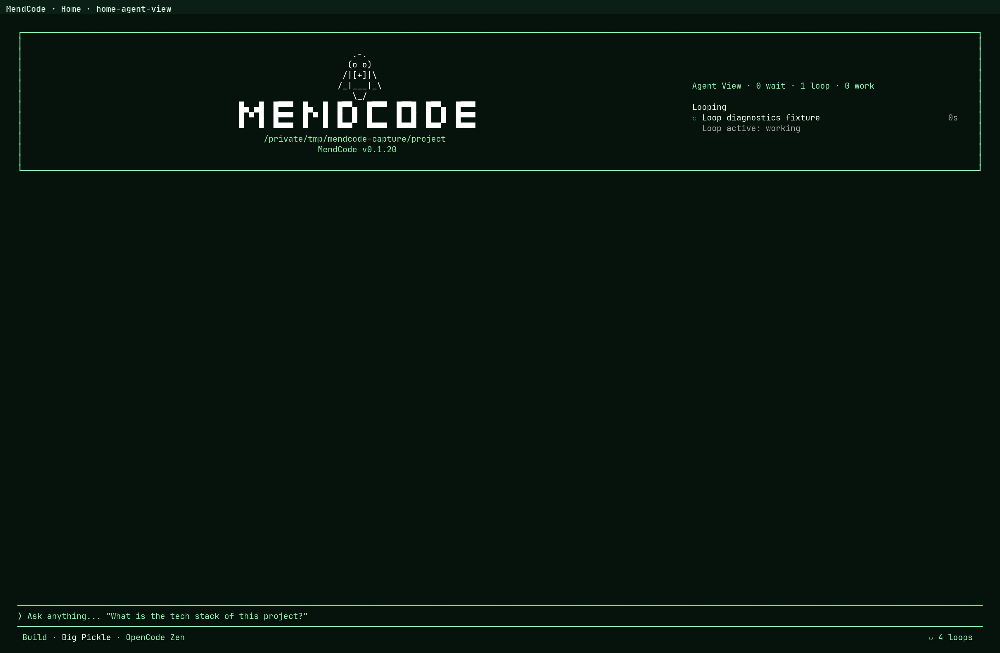</p>
</details>
</td>
<td valign="top" width="50%">
<details open>
<summary><strong>What can be themed</strong></summary>
<p>Home layout, title identity, mascot mode, prompt frame, prompt lead, status
placement, chat presentation, activity states, widgets, slots, custom routes,
dialogs, footer entries, and theme tokens.</p>
</details>
</td>
</tr>
</table>

### Marketplace Your Harness

A MendCode marketplace package captures the reusable parts of a team setup:

```text
.mendcode/
  agents/
  commands/
  modes/
  skills/
  prompts/
  plugins/
  tools/
  pages/
  tui/
  widgets/
```

Packages can include MCP config, context docs, scripts, TUI profiles, theme
tokens, custom tool calls, custom TUI pages, shell-backed widgets, model roles,
focus defaults, budget posture, permission defaults, memory defaults, and
worktree policy.

Packages must not include provider tokens, OAuth state, `.env*`,
`.mendcode/auth`, local databases, room secrets, or machine-local cache/run
state.

```bash
mendcode marketplace create --id acme-standard --title "Acme Standard" --include skills,modes,plugins,tools,pages
mendcode marketplace list
mendcode install acme-standard
mendcode marketplace install acme-standard
mendcode marketplace enable acme-standard
```

### Plan Mode

Plan Mode is for users who want the agent to think first without silently
editing files.

<p align="center">
  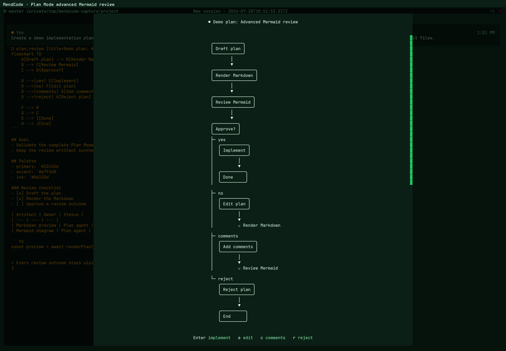
</p>

<p align="center">
  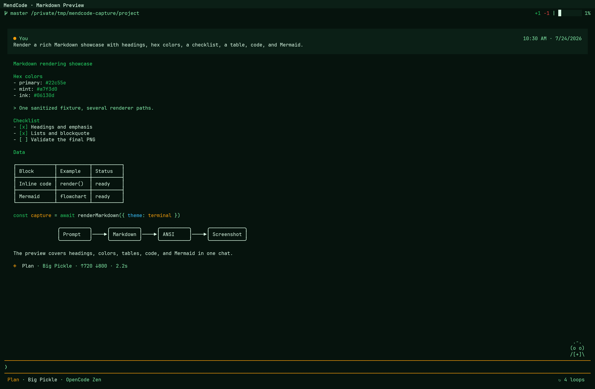
</p>

1. The planning agent researches and writes a Markdown plan.
2. MendCode renders the plan in a TUI modal.
3. The user can approve, edit, comment, reject, or close.
4. Approval switches into the configured implementation agent.
5. The reviewed Markdown becomes the source of truth for implementation.

See [Plan Mode](docs/plan-mode.md).

### Changes Review

Changes Review opens the current working-tree diff inside the TUI. It is a
review workspace, not just static patch text: move by file, hunk, or line; add
comments; reload the diff; then press `Esc` or `q` to return to chat without
stopping the active session.

<p align="center">
  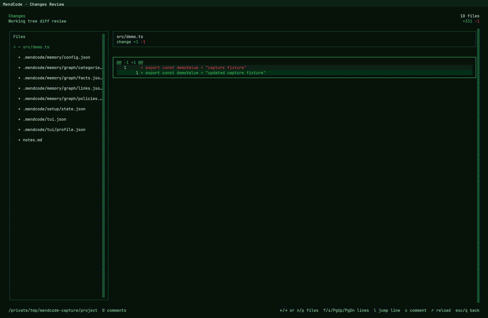
</p>

```text
/changes
```

When the view is active, MendCode gives the assistant bounded review context on
model turns: selected file/hunk/line, comments, stale comment count, and compact
file summaries. Comments added while an agent is working become visible to the
agent on the next model turn, including after a tool call completes. MendCode
does not splice new comments into an already-running token stream.

See [Changes Review](docs/changes-review.md).

### Loop Workflows

Loop Workflows are durable, monitorable loop sessions for objectives that should
keep moving across controlled iterations. Completion semantics and wakeup
cadence are separate, so the same runtime supports three clear shapes:

| Shape | Contract | When it stops |
| --- | --- | --- |
| Goal | `budgetMode: "max-goal"` plus concrete `completionCriteria` | As soon as completion is verified; an optional positive `maxTurns` is only a safety cap. |
| Recurring job | `budgetMode: "unbounded-monitor"` plus an `interval`, `daily`, `self-paced`, `adaptive`, or `external-signal` trigger | When explicitly stopped or blocked by a safety, budget, approval, or input gate. Omit `maxTurns`. |
| Bounded run | `budgetMode: "fixed"` plus a positive `maxTurns` | After the requested number of iterations unless stopped or blocked. |

A recurring job still has an objective, but the objective describes what each
wakeup should do rather than acting as an early-completion condition. A loop
starts from `/loop`, is supervised in `/loops`, becomes an activated root
session, records run/journal events, appears in Agent View, and can be woken
manually or by a per-project background service. The dashboard keeps its next
wakeup countdown live, shows scheduler health and evidence, and makes durable
`needs_input` permission waits visible instead of presenting them as failures.

<p align="center">
  
</p>

<p align="center">
  
</p>

```bash
mendcode loops examples
mendcode loops draft --template research-digest --name "Loop test"
mendcode loops activate loop_...
mendcode loops tick loop_... --execute --report-only
mendcode loops monitor loop_...
```

For a workflow whose durable contract is already report-only/read-only,
`--execute --report-only` wakes the agent and writes transcript activity without
edit/write/patch/shell/subagent tools. Edit-capable workflows keep their
contract; full execution remains explicit through `--execute` or
`mendcode loops service start --allow-edits`.

See [Loop Workflows](docs/loop-workflows.md).

### Memory With Control

MendCode memory is approval-first by design. It can retrieve useful project
context without turning every session into permanent state.

<p align="center">
  
</p>

- global and project scopes
- explicit `mendcode memory add`
- `mendcode memory search` and `mendcode memory preview`
- generated memory proposals
- apply, reject, and edit proposal flow
- transient prompt injection through bounded memory context

The Memory Center view brings saved memories, pending proposals, categories,
Dream state, project grouping, and a constrained memory side chat into one
reviewable workspace. See [Memory Center](docs/memory-center.md).

### Usage Insights

Usage Insights is local observability for the coding harness, not cloud
analytics and not a productivity claim.

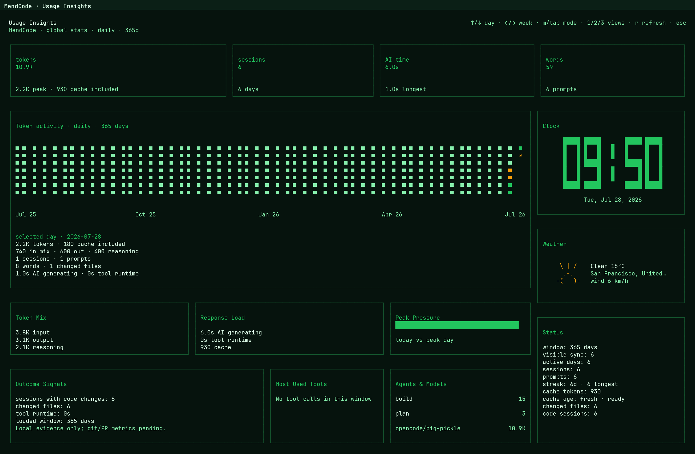

It can show global/project/directory scope, token heatmaps, sessions, active
days, prompt volume, AI generation time, tool runtime, changed files, top tools,
top agents, top models, cache mix, and optional weather.

See [Usage Insights](docs/usage-insights.md).

### Coordination: mflow, TSM, Worktrees

MendCode includes optional coordination for people running multiple terminal
sessions around the same codebase.

| Surface | Purpose |
| --- | --- |
| mflow | Local-first coordination, room activation, daemon status, and edit locks. |
| Worktrees | Preview-first creation, adoption, opening, reset, and removal of git worktrees. |
| TSM | Optional terminal-session workspace setup for MendCode panes. |

```bash
mendcode mflow setup
mendcode worktree plan feature-branch
mendcode worktree create feature-branch
mendcode tsm setup
```

## Documentation Map

| If you want to... | Read |
| --- | --- |
| Understand the whole product surface | [Feature map](docs/features.md) |
| Install, configure, and check readiness | [CLI, setup, and configuration](docs/cli-setup-configuration.md) |
| Shape the visual terminal experience | [Customization](docs/customization.md) |
| Share marketplace packages | [Marketplace and team sharing](docs/packages-and-team-sharing.md) |
| Let another agent control sessions | [Automation runtime](docs/automation-runtime.md) |
| Extend the TUI with code | [TUI plugins and widgets](docs/tui-plugins-and-widgets.md) |
| Create and activate a theme | [Themes](docs/themes.md) |
| Use plan review gates | [Plan Mode](docs/plan-mode.md) |
| Review working-tree changes | [Changes Review](docs/changes-review.md) |
| Run durable agent loops | [Loop Workflows](docs/loop-workflows.md) |
| Inspect local activity | [Usage Insights](docs/usage-insights.md) |
| Coordinate multi-session work | [mflow](docs/mflow.md), [TSM and worktrees](docs/tsm-and-worktrees.md) |
| Understand source layout and ownership | [Architecture](docs/architecture.md) |
| Release safely | [Releasing](docs/releasing.md), [Supply chain security](docs/supply-chain-security.md) |

## Development

This repository contains the MendCode-owned runtime under `src/mendcode/`.
Focused development usually happens in `src/mendcode/packages/opencode`.

Useful commands from an existing checkout:

```bash
cd src/mendcode/packages/opencode
bun test --timeout 30000
bun run typecheck
bun run build
```

The root `src/mendcode` package intentionally does not use `bun test` as the
normal test entrypoint; run focused tests from the package that owns the change.

## Community And Security

- [Contributing](CONTRIBUTING.md): local development, PR expectations, and review flow.
- [Security policy](SECURITY.md): supported reporting path for security issues.
- [Community docs](docs/community.md): issues, discussions, labels, and contribution guidance.
- [Release process](docs/releasing.md): release assets, checksums, installer smoke tests, and public promotion.
- [Supply chain security](docs/supply-chain-security.md): provenance, dependency review, scanners, and release hardening.

## For Agents

If you are an agent working in this repository, use this short path first:

1. Read the [source-level contributor contract](src/mendcode/AGENTS.md).
2. Use the public `mendcode` CLI and verify live source before documenting behavior.
3. Run focused checks from the package that owns the change; do not run tests from
   the repository root.
4. Keep changes minimal and never include provider tokens, auth state, or local
   runtime data in packages, screenshots, or docs.

### Agent theme workflow

When a user provides an image or visual reference, convert it into deterministic
theme JSON using the built-in color keys, then run the supported local flow:

```sh
mendcode theme validate ./my-theme.json
mendcode theme install ./my-theme.json --name studio --scope project
mendcode theme select studio --scope project
```

Project themes belong in `.mendcode/themes/` and the selection belongs in
`.mendcode/tui.json`; `--scope global` uses the XDG MendCode configuration
directory (`Global.Path.config`). Validation resolves references and variants,
rejects missing or circular references, and checks 3:1 text/background contrast
when hex colors can be resolved. Do not use `kv.json` as a substitute. See
[Themes](docs/themes.md) for the complete format. These commands are local-only
and do not call a model or provider.

<details>
<summary><strong>Open the full MendCode repo context for coding agents</strong></summary>

This block is intentionally collapsed so the README stays readable while still
giving coding agents MendCode context before editing docs, website copy, CLI help,
screenshots, or public claims. Treat it as context, then verify live code before
changing behavior.

### Public identity

- Product name: MendCode.
- Public command: `mendcode`.
- Local development checkouts may include a legacy `mend` shim. Public docs,
  examples, screenshots, release notes, website copy, and user-facing commands
  should use `mendcode` unless the router contract changes.
- MendCode is a downstream project built on opencode, with attribution in
  [ACKNOWLEDGEMENTS.md](ACKNOWLEDGEMENTS.md). Do not present it as a simple
  rename.

### Public CLI contract

- Source of truth: `src/mendcode/packages/opencode/src/mend/cli/public-bin.ts`.
- Re-run public help before adding command examples.
- Primary public surfaces include opening the TUI, `run`, `session`, `chat`,
  `status`, `doctor`, `setup`, `marketplace`, `mflow`, `worktree`, and `tsm`.
- Automation details live in [docs/automation-runtime.md](docs/automation-runtime.md):
  `mendcode.cli.v1` JSON envelopes, session lifecycle commands, progress events,
  bounded waiting, cancellation, secret redaction, and shared model/agent
  selection. It is a wrapper over the existing runtime, not a second provider
  or session implementation.
- Support surfaces include `models`, `providers`, `auth`, `permissions`,
  `memory`, and `focus`.
- Internal debug surfaces such as `adapter`, `ai`, `bench`, `budget`, `config`,
  `context`, `export`, `mcp`, `prompt`, `prompts`, `runtime`, `toolchain`,
  `tui`, and `upstream` should not be marketed as normal user workflows.

### Core product story

- MendCode is the customizable coding terminal: CLI, TUI, setup flow, model
  roles, permission policy, memory, runtime marketplace packages, Plan Mode,
  Usage Insights, optional mflow coordination, optional TSM and worktree
  orchestration, widgets, plugins, and TUI profiles.
- The pitch is not another chat prompt. The pitch is a configurable harness:
  prompt chrome, status rows, model roles, memory policy, marketplace packages,
  workflow coordination, review gates, and local observability.

### Agent product context

When an agent needs to explain what MendCode is to a reader, start with this
accurate description:

This inventory was checked against the 20 latest changelog entries, `0.1.9`
through `0.1.28`. Use the changelog for release-specific fixes; keep this block
focused on stable product capabilities and agent-facing contracts.

> MendCode is a terminal-first AI coding terminal and developer harness. It
> gives a local agent a configurable CLI/TUI, model roles, review gates,
> permissions, memory, reusable team packages, session automation, and optional
> multi-agent/worktree coordination.

Classify follow-up details by the product surface they change, and use the
linked documentation as the source for details:

| Category | Explain it as | Primary references |
| --- | --- | --- |
| Core terminal | The public `mendcode` CLI, TUI, setup/onboarding flow, provider/package setup, diagnostics, and session runtime. | [Feature map](docs/features.md), [CLI and setup](docs/cli-setup-configuration.md) |
| Prompt and model control | Prompt Context modes (`minimal`, `focus`, `full`, and project/package `custom`), `.mendcode/prompts/custom.md`, `mendcode prompt` inspection/build commands, model roles and variants, prompt status, provider-aware context continuity, image-aware compaction, and cost-aware routing. | [Feature map](docs/features.md), [CLI and setup](docs/cli-setup-configuration.md) |
| Workflow and review | Plan Mode, Changes Review, and durable Loop Workflows with validated plans, gates, schedules, receipts, artifacts, evaluators, and recovery. | [Plan Mode](docs/plan-mode.md), [Changes Review](docs/changes-review.md), [Loop Workflows](docs/loop-workflows.md) |
| Media generation | The provider-aware `image_gen` tool, configured independently from the active chat model, with persisted artifacts, optional captions, and safe edit inputs when the provider contract and permissions allow. | [Changelog](CHANGELOG.md) |
| Control and safety | Model roles, smart permissions, budgets, approval-first Memory Center, Memory Graph, and Dream flows, local provider bridges, and explicit destructive-action gates. | [CLI and setup](docs/cli-setup-configuration.md), [Memory Center](docs/memory-center.md), [TSM and worktrees](docs/tsm-and-worktrees.md) |
| Team and extensibility | Runtime packages, project MCP configuration, package-shared prompts/custom tool calls, TUI profiles, plugins, widgets, pages, and themes. | [Packages and team sharing](docs/packages-and-team-sharing.md), [Custom Tool Calls](docs/custom-tool-calls.md), [TUI plugins and widgets](docs/tui-plugins-and-widgets.md) |
| Agent and background execution | Agent View, subagents, detached background tasks, queued prompts, reconnect/compaction recovery, and Herdr state reporting. | [Automation runtime](docs/automation-runtime.md), [Loop Workflows](docs/loop-workflows.md), [Feature map](docs/features.md) |
| Coordination and operations | Optional mflow locks, TSM/worktree orchestration, automation commands, local Usage Insights, update discovery, and in-app upgrades. | [mflow](docs/mflow.md), [TSM and worktrees](docs/tsm-and-worktrees.md), [Automation runtime](docs/automation-runtime.md), [Usage Insights](docs/usage-insights.md) |

### Image generation contract

The implementation source is `src/mendcode/packages/opencode/src/tool/image-gen.ts`.
Agents must keep these rules intact:

- `image_gen` is independently configured through `image_generation`; it is not
  inferred from the active chat model. Configuration supports `enabled`, a
  `provider/model` reference, `adapter` (`auto`, `codex-oauth`, `openrouter`, or
  `openai-compatible`), `base_url`, timeout, provider options, and optional
  captions. `enabled: false` must hide the tool.
- With an active OpenAI ChatGPT subscription OAuth login and no explicit image
  model, the verified Codex adapter defaults to `openai/gpt-image-2`. API-key
  sessions do not receive that OAuth fallback automatically. Auto adapter
  selection is limited to verified provider contracts; unknown image-capable
  providers require an explicit adapter.
- Use it only for an explicit request to create or edit a bitmap image. Include
  orientation, aspect ratio, target resolution, exact text, visual constraints,
  and avoid-items in the prompt. For a new image, omit both reference fields
  (`num_last_images_to_include: 0` is also valid). For edits, provide either up
  to five absolute local image paths or one to five recent conversation images,
  never both.
- The `image_gen` permission is checked before the request; referenced local
  images also require read permission and must stay within the allowed project
  boundaries. Enforce the 50 MB input/output bounds, request timeout, safe image
  URLs, and cancellation.
- Generated artifacts are persisted under MendCode's managed `generated_images`
  directory and returned with metadata, format, dimensions, size, provider,
  adapter, model, path, and cost when available. The full TUI shows the saved
  path and external-open actions instead of rendering the image inline.
- Captions are optional and use an independently configured vision model. A
  missing or failed optional caption must not discard the saved artifact; a
  required caption may fail the tool after the artifact has been persisted.
- For project-bound work, copy the selected artifact into the workspace with a
  stable descriptive filename and never overwrite an existing asset unless the
  user explicitly requests replacement. Do not expose tokens, auth state, or
  sensitive source images in prompts, captions, artifacts, or docs.

### Agent operating contract

- Activate a Loop Workflow or delegate background work only when the user asks
  for it or the request clearly includes that intent. Inspect existing loops
  before creating another one; never use `maxTurns: 0` or recreate an invalid
  `completed 0/0` workflow.
- Choose the loop shape from intent: use `max-goal` with concrete completion
  criteria for a verifiable goal, `unbounded-monitor` without `maxTurns` for a
  recurring scheduled job, and `fixed` with a positive `maxTurns` only for an
  exact iteration count. Do not spread goal work across the full safety cap.
- Treat cadence and completion as independent. `daily` uses `dailyAt` plus an
  explicit timezone; interval and self-paced/adaptive/external-signal triggers
  wake the same durable objective repeatedly. A scheduled loop's objective
  describes each wakeup and does not imply early completion after the first run.
- A `needs_input` state is a durable permission or user-decision wait. Resume
  the same run after input arrives; do not report it as completed, failed, or a
  reason to create a duplicate loop. In `/loops`, persisted `nextWakeup` is the
  source of truth while the visible countdown is reactive presentation.
- Use report-only/read-only execution for inspection and monitoring. An explicit
  request to write, edit, fix, implement, code, or create files permits normal
  execution for that workflow; keep destructive worktree actions preview-first.
- Route work through the configured model roles and variants with cost-aware,
  provider-neutral language. Do not present internal debug surfaces as normal
  user workflows.
- Treat `memoryAssistant` as a constrained memory-stewardship agent and Dream
  as a proposal-producing maintenance loop, not as silent source editing or a
  general coding agent. Generated memory changes remain reviewable proposals
  until the user applies them.
- Treat `image_gen` availability as provider- and permission-gated. It is an
  independently configured media tool, not an assumption about the active chat
  model; preserve artifacts and redact sensitive inputs.

The short explanation is not “another chat box” or a cloud analytics product.
It is a local-first control surface for shaping how coding agents work.

### Screenshots and demos

- Use [the feature map](docs/features.md) as the source contract for README,
  website, screenshot, and demo claims.
- README screenshots live in `docs/assets/screenshots/`. Website copies live in
  the MendCode-Web repository under `public/screenshots/` and
  `public/tui-showcase/`.
- There is currently no checked-in capture script or `mendcode screenshot`
  command. Existing images are committed static assets; do not describe an
  automated or canonical capture flow unless one is added and verified.
- For future captures, validate the public `mendcode` behavior first, use a
  clean demo state, redact provider tokens/auth state/local runtime data, and
  update the image alt text or caption with the exact product surface shown.

### TUI customization

- Main user-facing docs: [Customization](docs/customization.md) and
  [TUI plugins and widgets](docs/tui-plugins-and-widgets.md).
- Profile path: `.mendcode/tui/profile.json`.
- Key surfaces: prompt frame, prompt lead string, prompt status row, home title,
  mascot mode, centered home, split home, Agent View, chat presentation,
  activity states, widgets, slots, custom routes, dialogs, footer entries,
  themes, density, and package-distributed UI behavior.
- Chat presentation includes Plain/Markdown/Rich rendering, streaming Markdown,
  wrapped tables and code fences, checklists, callouts, local Mermaid diagrams,
  and terminal-safe color swatches.
- Good demo profile: mascot identity, split home, `agentManager` right panel,
  `top-bottom` prompt chrome, `mendcode>` lead text, and outside prompt status.

### Marketplace Packages

- Main docs: [Marketplace and team sharing](docs/packages-and-team-sharing.md).
- Marketplace packages can include commands, agents, modes, skills, prompts,
  MCP config, context docs, scripts, plugins, widgets, components, custom tools,
  custom pages, TUI profile, themes, model roles, focus defaults, budget
  posture, permission defaults, memory defaults, and worktree policy.
- Packages must not include provider tokens, OAuth state, `.env*`, auth state,
  local databases, room secrets, or machine-local run/cache state.

### Custom tool calls

- Custom tool calls are assistant-facing project or package actions loaded from
  `.mendcode/tools` (the singular `.mendcode/tool` path is also supported). They
  are local TypeScript/JavaScript code with a description and validated argument
  schema; they are not MCP tools.
- `execute(args, context)` receives the current `sessionID`, `messageID`,
  `agent`, `directory`, `worktree`, cancellation via `abort`, visible-call
  updates through `metadata()`, and permission requests through `ask()`.
- `tool.schema` defines the validation and JSON schema exposed to the model.
  Tools may return concise output plus metadata, and should honor cancellation
  and avoid silent writes outside the current project/worktree.
- Packages share tools through an `artifacts.tools` manifest entry or a
  project-local `.mendcode/package.json`. Custom tools are trusted local code:
  review them before enabling a package and never distribute credentials,
  `.env*`, auth state, or machine-local data.

### Review, memory, and safety

- Plan Mode is an explicit review gate before implementation.
- Memory is approval-first: global/project scopes, explicit add/search/preview
  flows, generated proposals, and apply/reject/edit review.
- Memory Center is the user-facing memory workspace: saved global/project
  memories, pending proposals, project grouping, the Memory Graph/category graph,
  category policy, Dream status/logs, inspector, and constrained memory side chat.
- The memory side agent can answer memory-specific questions, inspect saved
  entries/categories/policies, explain why context is being retrieved, and draft
  reviewable proposals for memory/category/policy changes. It should be
  described as powerful for memory stewardship, not as a general coding agent.
- Dream is the manual/scheduled memory maintenance loop. It can consolidate
  stale or duplicated knowledge, surface conflicts, generate safety evidence,
  and create proposals through the `memoryDream` role; it should not be claimed
  to edit source files, mutate git, or apply memory silently.
- Generated memory mutations remain proposals unless the user explicitly applies
  them. This applies to extraction, side chat, and Dream.
- Usage Insights is local observability, not cloud analytics and not a
  productivity guarantee.
- Smart permissions can route risky actions through a configured reviewer role.

### Coordination

- mflow is optional local-first coordination and lock/status support.
- Worktree and TSM flows are optional terminal/worktree orchestration.
- Destructive worktree actions should stay preview-first and gated.

### Documentation map

- [Feature map](docs/features.md): product inventory for README, website,
  screenshots, and demos.
- [Docs index](docs/README.md): user journey index.
- [CLI, setup, and configuration](docs/cli-setup-configuration.md): setup,
  config, models, permissions, and memory.
- [Customization](docs/customization.md): static TUI profile and visual
  customization.
- [TUI plugins and widgets](docs/tui-plugins-and-widgets.md): dynamic TUI
  extension points.
- [Custom Tool Calls](docs/custom-tool-calls.md): project/package assistant
  tools, typed arguments, execution context, metadata, cancellation, and
  permission checks.
- [Plan Mode](docs/plan-mode.md): plan review flow.
- [Changes Review](docs/changes-review.md): responsive diff review, comments,
  keybinds, and agent-visible review context.
- [Loop Workflows](docs/loop-workflows.md): durable loop sessions, root
  session/evaluator boundaries, `/loop`, `/loops`, and service controls.
- [Automation runtime](docs/automation-runtime.md): machine-readable session
  control, progress events, waiting, cancellation, and shared model selection.
- [Memory Center](docs/memory-center.md): saved/pending memories, categories,
  Dream maintenance, and the constrained memory side agent.
- [Usage Insights](docs/usage-insights.md): local activity dashboard.
- [mflow](docs/mflow.md): local-first coordination.
- [TSM and worktrees](docs/tsm-and-worktrees.md): terminal/worktree orchestration.
- [Architecture](docs/architecture.md): source layout and ownership boundaries.
- [Releasing](docs/releasing.md) and
  [Supply chain security](docs/supply-chain-security.md): release and supply
  chain policy.

### Public copy rules

- Keep docs provider-neutral unless a user explicitly asks for provider-specific
  examples.
- Avoid aspirational feature claims without a source path, validated behavior,
  or clearly marked local work.
- Prefer factual capability wording over behavioral prompt instructions.
- If code contradicts this block, the code wins.

</details>

## Lineage

MendCode is a downstream project built on the opencode codebase. It is not
presented as a simple fork: MendCode adds its own `mendcode` CLI surface,
control plane, setup flow, package system, mflow coordination, optional
TSM/worktree orchestration, Plan Mode review flow, Usage Insights dashboard,
memory policy, model-role projection, and terminal UI customization layer.

See [ACKNOWLEDGEMENTS.md](ACKNOWLEDGEMENTS.md) for attribution.

<h1 align="center">
  <picture>
    <source media="(prefers-color-scheme: dark)" srcset="docs/assets/branding/mendcode-logo-horizontal-white.svg">
    <source media="(prefers-color-scheme: light)" srcset="docs/assets/branding/mendcode-logo-horizontal-master.svg">
    
  </picture>
</h1>
