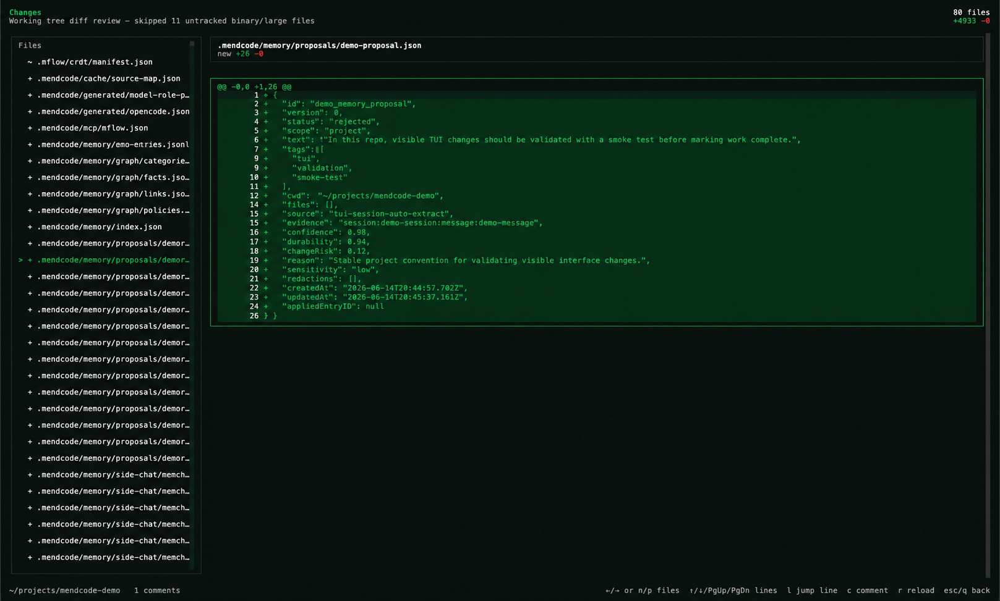

# Changes Review

Changes Review is the TUI workspace for inspecting the current repository diff
without leaving MendCode. It is designed for human review and agent
coordination: you can navigate files and diff blocks, leave comments on the
visible diff, return to chat, and let the assistant read the active review
context on its next model turn.

Open it from the command palette or slash command:

```text
/changes
/diff
/review-changes
```



## What The View Shows

The route loads the active workspace diff and renders it as a terminal-native
review surface.

| Area          | Purpose                                                                                                             |
| ------------- | ------------------------------------------------------------------------------------------------------------------- |
| Header        | Shows file count, additions/deletions, loading state, and warnings such as skipped large or binary untracked files. |
| File list     | Shows changed files with status markers and the active file selection.                                              |
| Diff stream   | Shows the selected file, diff blocks, line numbers, additions, removals, context, and inline review comments.       |
| Keybind bar   | Keeps navigation shortcuts visible at the bottom of the page.                                                       |
| Footer status | Shows the active workspace root and current comment count.                                                          |

## Diff Scope

The default `/changes` scope is the local working tree:

- tracked file changes from `git diff --no-ext-diff --patch HEAD --`;
- small text untracked files through normalized `git diff --no-index` patches;
- no network call, GitHub API call, or remote fetch.

It is not a GitHub PR diff and it is not "all commits not pushed to GitHub".
Committed changes are not shown by the default working-tree scope, even if they
have not been pushed yet. Pushing to GitHub does not change the view by itself;
committing or otherwise making the working tree clean will remove those files on
the next reload.

This default is intentional for agent work: `/changes` shows the live files the
agent is currently changing before they become commits. A future branch/PR scope
can compare the current branch against an upstream or base branch, but it should
be a visible mode switch so files do not disappear or change meaning
silently.

Large or likely-binary untracked files are skipped and summarized in the header
so the prompt and TUI do not get flooded.

## Keybinds

| Key                   | Action                                                                 |
| --------------------- | ---------------------------------------------------------------------- |
| `j` / `Down`          | Move to the next selectable diff line.                                 |
| `k` / `Up`            | Move to the previous selectable diff line.                             |
| `PageDown` / `Ctrl-D` | Move down by roughly one visible page in the active file.              |
| `PageUp` / `Ctrl-U`   | Move up by roughly one visible page in the active file.                |
| `g`                   | Jump to the first selectable line in the active file.                  |
| `G`                   | Jump to the last selectable line in the active file.                   |
| `l`                   | Jump to a new or old line number in the active file.                   |
| `]` / `}`             | Move to the next diff block.                                           |
| `[` / `{`             | Move to the previous diff block.                                       |
| `n` / `Right`         | Move to the next file.                                                 |
| `p` / `Left`          | Move to the previous file.                                             |
| `c`                   | Add a review comment anchored to the active line or diff block.        |
| `r`                   | Reload the working-tree diff and re-anchor comments where possible.    |
| `Esc` / `q`           | Return to the previous chat/session route without stopping agent work. |

The keybind bar has compact and full labels. Wide terminals show the full
labels; narrower terminals use shorter text so the footer remains readable.

## Comments And Agent Visibility

Comments are stored in the active MendCode review state and mirrored to a small
local cache outside the repository. They can be attached to the selected diff
block or to the selected old/new line. On reload, MendCode attempts to keep the
same anchors; comments whose file, block, or line no longer exists are marked
stale instead of being silently moved to a wrong location.

The assistant receives bounded review context through
`<mendcode_review_context>` when a model turn is built. That context includes:

- changed-file stats;
- the selected file, diff block, and line;
- visible user and assistant comments;
- stale comment count;
- compact file and block summaries.

This means a comment added while an agent is working can be seen on the next
model turn, including the next turn after a tool call completes. The model
cannot receive new context in the middle of an already-running token stream
without interrupting that stream. The safe behavior is:

1. The agent starts a turn with the review context available at that moment.
2. The user can open `/changes`, move around, and add comments while tools run.
3. When the agent finishes a tool call and the runtime starts the next model
   turn, MendCode rebuilds the system context and includes the latest review
   state. If the route and agent do not share the same in-memory process state,
   MendCode reconstructs the review from the current working-tree diff and the
   cached selection/comments.
4. The agent can also call the `review` tool to inspect the current selection,
   load a specific file summary, navigate the review, reload the diff, or manage
   comments.

Raw patches are not injected into the prompt by default. The agent should ask
for a single file patch through the `review` tool only when the compact summary
is not enough.

## Review Tool

The built-in `review` tool exposes the active Changes Review workspace to the
assistant.

| Action                | Purpose                                                                 |
| --------------------- | ----------------------------------------------------------------------- |
| `current` / `summary` | Return bounded review context for the active workspace.                 |
| `file`                | Return the selected or requested file summary, with optional raw patch. |
| `navigate`            | Move the active review selection by file or diff block.                 |
| `reload`              | Reload the working-tree diff and reconcile comments.                    |
| `comment_add`         | Add a visible review comment.                                           |
| `comment_list`        | List review comments.                                                   |
| `comment_clear`       | Clear all, scoped, or stale comments.                                   |

The tool does not edit files, stage changes, revert changes, submit PR reviews,
or require an external diff review app.

## Responsive Behavior

Changes Review adapts to terminal size:

- wide terminals render a split layout with a file sidebar and diff stream;
- compact terminals stack the file list above the diff stream in one scroll
  surface;
- the diff stream uses stable line-number columns and truncates long code lines
  instead of resizing the layout;
- the footer keybind bar switches to compact labels when space is tight.

The goal is not to reproduce a web review page in a terminal. The goal is a
stable TUI review surface that keeps selection, scroll, comments, and agent
context aligned.

## Implementation Notes

Git diff parsers call each contiguous block of changed lines a "block".
MendCode's user-facing UI calls these "diff blocks" so the feature does not
sound like it is embedding or rebranding another review product.

The direct external-app path was rejected for the current MendCode
implementation because that would couple this route to another TUI framework
surface and create a maintenance fork for a feature that should live inside
MendCode's route, session, prompt, and tool systems.

MendCode owns the review state, comments, prompt bridge, and assistant tool.
Diff parsing and block structure use the existing `@pierre/diffs` dependency.

## Persistence Model

Review state is keyed by workspace root. The live TUI state remains
process-local, but selection and comments are mirrored to a local MendCode cache
under the user's home directory, not inside the repository. The cache lets the
assistant prompt and `review` tool recover the active review comments if the TUI
route and the agent turn do not share the same process-local `Map`.

The cached state is intentionally lightweight: it stores selection, comments,
and timestamps, not raw patches. The current diff is always reloaded from git
before assistant context is built.

It is not a durable PR review, git note, saved memory, or synced collaboration
record. Clearing the active review state clears the cache for that workspace.

Durable review artifacts can be added later if comments need to survive process
restart, sync across terminals, or become part of a PR/review workflow.

## Source Map

- `src/mendcode/packages/opencode/src/cli/cmd/tui/routes/changes/index.tsx`:
  route shell, loading, key handling, reload, comments, and responsive layout.
- `src/mendcode/packages/opencode/src/cli/cmd/tui/routes/changes/load-diff.ts`:
  tracked and untracked diff loading.
- `src/mendcode/packages/opencode/src/cli/cmd/tui/routes/changes/review-state.ts`:
  parsed files, diff blocks, lines, selection, stats, and navigation.
- `src/mendcode/packages/opencode/src/cli/cmd/tui/routes/changes/review-comments.ts`:
  comment creation, filtering, clearing, and stale-anchor reconciliation.
- `src/mendcode/packages/opencode/src/cli/cmd/tui/routes/changes/review-context.ts`:
  bounded assistant summaries and optional selected-file patch access.
- `src/mendcode/packages/opencode/src/cli/cmd/tui/routes/changes/review-actions.ts`:
  process-local active review registry, local cache bridge, and imperative
  actions.
- `src/mendcode/packages/opencode/src/cli/cmd/tui/routes/changes/renderer-adapter.tsx`:
  header, file navigation, diff renderer, inline comments, and keybind bar.
- `src/mendcode/packages/opencode/src/tool/review.ts`: assistant-facing
  `review` tool.
- `src/mendcode/packages/opencode/src/session/prompt.ts`: injects
  `<mendcode_review_context>` into model turns when a review is active.
