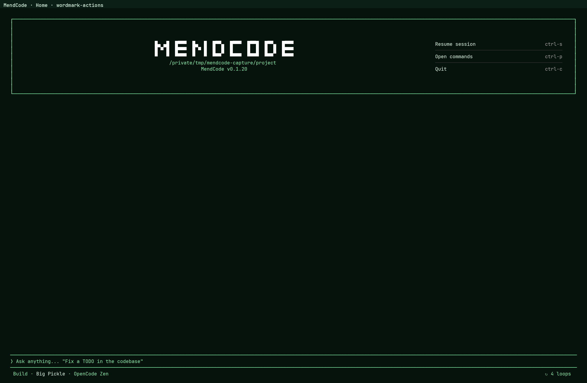

# Customization

MendCode customization is centered on `.mendcode/` config plus optional runtime packages. The goal is simple: a person, team, or company should be able to make the terminal feel like their own product without editing runtime internals.

The main profile is `.mendcode/tui/profile.json`. It controls the prompt input, input marker, bottom status, home title or mascot, centered/split home layout, Agent View panel, activity rendering, activity mascot states, widgets, theme, and density.



Most visual settings are also available from the command palette inside the TUI:

```text
Ctrl+P -> Home identity
Ctrl+P -> Home title text
Ctrl+P -> Home title font
Ctrl+P -> Home mascot ASCII
Ctrl+P -> Home welcome mode
Ctrl+P -> Home split panel
Ctrl+P -> Prompt chrome
Ctrl+P -> Prompt lead string
Ctrl+P -> Prompt status placement
Ctrl+P -> Chat presentation
Ctrl+P -> Customize TUI
```

The command palette currently edits the Home mascot directly. The compact session mascot is configured through the profile JSON or a TUI package; a dedicated per-state editor and first-class ASCII-pack importer are not available yet. Home art and session art are independent, so changing one does not overwrite the other.

## Mental Model

There are four layers:

1. Home identity: what appears on the home screen before a chat starts.
2. Prompt input: the editor frame, prompt marker, right-side prompt slot, and status row.
3. Session presentation: how assistant messages, reasoning, tools, diffs, and activity are rendered.
4. Runtime extensions: widgets, slots, footer entries, plugin routes, package-distributed themes, and scripts.

Use the profile for stable product/team defaults. Use TUI plugins when behavior needs code, live data, custom routes, or dynamic UI.

## Live TUI Customization

For session chrome, use one command instead of hunting through separate appearance commands:

```text
Ctrl+P -> Customize TUI
/customize
```

`Customize TUI` opens a grouped modal. Items marked `[on]`/`[off]` are live toggles: `Space` or `Enter` applies them immediately and the TUI does not restart. Profile entries such as Home identity, Home title, and Prompt chrome are actions, not toggles; `Enter` opens their editor and they never show a toggle state. The `Appearance` category is intentionally not exposed in the command palette. The defaults enable context usage, diff line count, session title, project location, and terminal window title; the changed-file count is off by default.

The modal also exposes a deterministic random accent per session and maintenance actions. Changes are persisted in the TUI KV store under `mendcode_tui_customization`, while `terminal_title_enabled` remains a compatibility key for older profiles.

### Terminal title and session accent

The terminal title supports these tokens:

| Token | Value |
| --- | --- |
| `{product}` | Active product name. |
| `{session}` | Current session title or route label. |
| `{route}` | Current TUI route. |
| `{path}` | Active project path. |

The public runtime API uses the same contract:

```ts
api.ui.runtime.customization.setTerminalTitle({
  enabled: true,
  template: "{product} · {session} · {path}",
})
api.ui.runtime.customization.setSessionAccent("random")
api.ui.runtime.customization.setDiffFiles(true)
```

### Rollback

To restore the default live chrome, choose `Reset TUI customization` in the modal or call:

```ts
api.ui.runtime.customization.reset()
```

This only resets the customization contract; it does not change profile files, sessions, messages, widgets, or project data.

## Recommended Product Profiles

These are not separate built-in themes; they are starting points for profiles a person or team can ship.

| Profile | Key settings | Best for |
| --- | --- | --- |
| Clean daily driver | `promptChrome.preset: "top-bottom"`, status outside, `presentation.profile: "mendcode"`, command hints hidden. | Everyday coding with low chrome and enough context. |
| Team-branded shell | `identity.productName`, `identity.logoFont`, `promptChrome.glyphs.leadText`, custom status script. | Company/team environments that need a recognizable terminal surface. |
| Agent cockpit | `surfaces.homeWelcome.mode: "split"`, `surfaces.homeWelcome.rightPanel: "agentManager"`. | Background sessions, delegated work, and follow-up queues. |
| SSH/ASCII safe | `promptChrome.preset: "ascii-box"`, status inside, compact mascot/title. | Remote terminals, simpler fonts, narrow machines. |
| Low-noise review | `presentation.profile: "minimal"`, fewer status items, no mascot activity. | Review-heavy or pair-programming sessions where visual motion is distracting. |

## TUI Profile Shape

The active TUI profile has these major sections:

- `identity`: product name, tagline, home identity mode, ASCII title font.
- `theme`: dark/light mode, palette, and core color tokens.
- `layout`: density, spacing, borders, width, and zone behavior.
- `widgets`: enabled widget IDs, order, and widget-specific config.
- `surfaces`: model/provider/status visibility, home logo, and home welcome layout.
- `promptChrome`: prompt frame style, sides, border style, glyphs, and input marker.
- `promptStatus`: built-in status items, placement, separator, colors, and script-backed status.
- `workingIndicator`: visible thinking/working text fallback, elapsed time, and token display.
- `presentation`: raw/minimal/MendCode chat rendering, reasoning visibility, activity placement, activity text, mascot states, and completion symbol.
- `rollback`: profile rollback metadata.

## Prompt Input

The prompt input is the editor area at the bottom of the home/session screen. MendCode calls its frame `promptChrome`.

Supported prompt chrome presets:

| Preset | What it feels like | Good for |
| --- | --- | --- |
| `box` | Full bordered prompt with top, bottom, left, and right edges. | Strong product identity and visible input boundaries. |
| `top-bottom` | Horizontal rails only, with a lead input marker. | Clean everyday coding setup. |
| `minimal` | No border, just the prompt panel and status. | Low-chrome terminal workflows. |
| `ascii-box` | Full box using plain ASCII borders. | Old terminals, SSH, retro/team themes. |

`left-rail` exists as a legacy preset name in the type layer, but profile normalization maps it to `top-bottom`. Prefer the four presets above for new config.

Example:

```jsonc
{
  "promptChrome": {
    "preset": "top-bottom",
    "borderStyle": "rounded",
    "glyphs": {
      "leadText": "mendcode>"
    }
  }
}
```

## Input Marker

The input marker is `promptChrome.glyphs.leadText`. It is the short string shown at the start of the input line for presets that render a lead marker.

Default marker:

```text
❭
```

Examples:

```jsonc
{
  "promptChrome": {
    "glyphs": {
      "leadText": ">"
    }
  }
}
```

```jsonc
{
  "promptChrome": {
    "glyphs": {
      "leadText": "mendcode>"
    }
  }
}
```

```jsonc
{
  "promptChrome": {
    "glyphs": {
      "leadText": "ship>"
    }
  }
}
```

Keep it short. A long marker competes with the user's prompt and makes narrow terminals feel cramped.

## Prompt Status

`promptStatus` controls the metadata row around the prompt. It can render outside the prompt or inside it, depending on the active chrome preset.

Default behavior:

```jsonc
{
  "promptStatus": {
    "enabled": true,
    "placementByPreset": {
      "box": "outside",
      "top-bottom": "outside",
      "minimal": "outside",
      "ascii-box": "inside"
    },
    "left": [
      { "type": "builtin", "value": "mode" },
      { "type": "builtin", "value": "model" },
      { "type": "builtin", "value": "provider" },
      { "type": "builtin", "value": "reasoning" }
    ],
    "right": [
      { "type": "builtin", "value": "context" }
    ],
    "separator": " · "
  }
}
```

Built-in status values:

| Value | Meaning |
| --- | --- |
| `mode` | Current prompt mode or active agent label. |
| `model` | Resolved model name for the current session. |
| `provider` | Resolved provider label. |
| `reasoning` | Current reasoning/effort variant when exposed by the model. |
| `variant` | Explicit model variant alias. |
| `context` | Context usage summary. |
| `permissionMode` | Current permission mode and pending permission prompts. |
| `commandsHint` | Command palette hint. |
| `agentsHint` | Agent switching/cycling hint. |

Compact bottom-status example:

```jsonc
{
  "promptStatus": {
    "commandsHint": { "visible": false },
    "placementByPreset": {
      "top-bottom": "outside",
      "ascii-box": "inside"
    },
    "left": [
      { "type": "builtin", "value": "mode" },
      { "type": "builtin", "value": "model" }
    ],
    "right": [
      { "type": "builtin", "value": "context" },
      { "type": "builtin", "value": "permissionMode" }
    ],
    "separator": "  "
  }
}
```

## Script-Backed Status

`promptStatus.scripts.left` and `promptStatus.scripts.right` can call local scripts to add custom status.

Example:

```jsonc
{
  "promptStatus": {
    "scripts": {
      "right": {
        "enabled": true,
        "command": "./.mendcode/tui/prompt-status.sh",
        "timeoutMs": 150,
        "refreshMs": 1000,
        "prepend": false
      }
    }
  }
}
```

Script output can be plain text:

```text
dev · clean · package:team
```

It can be JSON segments:

```json
{
  "segments": [
    { "text": "dev", "fg": "#86efac", "bold": true },
    { "text": " · clean", "fg": "#a3a3a3" }
  ]
}
```

Or TSV segments:

```text
#86efac	true	dev
#a3a3a3	false	 · clean
```

Good custom status values are short and operational: branch, dirty/clean, active package, provider, context, permissions, mflow/worktree state.

## Home Identity

The home identity can be an ASCII title or an ASCII mascot.

```jsonc
{
  "identity": {
    "productName": "MendCode",
    "tagline": "terminal-first coding",
    "logoMode": "title",
    "logoFont": "mendcode"
  }
}
```

Supported `identity.logoMode` values:

- `title`: render a generated ASCII title from `identity.productName`.
- `mascot`: render the configured home mascot and enable compact activity mascot feedback.

Supported `identity.logoFont` values:

- `mendcode`
- `small`
- `standard`
- `shadow`

`classic` and `opencode` may appear in older config. New config should use the values above.

## Home Title

The home title text is `identity.productName`. It is used for generated ASCII title mode, terminal title, and several labels.

Example company title:

```jsonc
{
  "identity": {
    "productName": "AcmeCode",
    "logoMode": "title",
    "logoFont": "shadow"
  }
}
```

That keeps the home screen logo textual and brand-like. It is the better choice when the team wants a product mark, department name, or company coding shell.

## Mascot

Mascot mode uses ASCII art as the home identity. Session activity mascot states are configured separately and can stay enabled with either Home identity mode.

```jsonc
{
  "identity": {
    "productName": "MendCode",
    "logoMode": "mascot"
  }
}
```

You can replace the home mascot completely with `surfaces.homeLogo.text` or `home.logo.text` in config:

```jsonc
{
  "identity": {
    "logoMode": "mascot"
  },
  "surfaces": {
    "homeLogo": {
      "text": "   /\\\\\n  /++\\\\\n <|__|>\n  /__\\\\"
    }
  }
}
```

Keep custom mascot art monospaced, low-height, and visually stable. The home screen adapts to terminal size; huge ASCII art will disappear on compact/tiny screens.

### Change it from the TUI

From Home, open `Ctrl+P` and choose **Home mascot ASCII**. Paste the multiline art, submit it, and MendCode switches Home to mascot mode. Submitting a blank value restores the default mascot. This changes only `surfaces.homeLogo.text`; it does not change the session activity mascot.

## Default Home Mascot

Default mascot:

```text
      .-.
     (o o)
    /|[+]|\
   /_|___|_\
      \_/
```

## Activity Mascot States

The compact activity mascot above the session prompt can change with the current phase. It is independent from the Home identity mode, so Home can use a generated title while the session prompt still uses state-specific mascot art.

The current built-in controls expose Home art, not individual session states. To customize the session mascot, edit the profile JSON or ship the profile through a TUI package. A single custom state is enough for a static pet; state-specific art can give the character different faces or poses while MendCode is thinking, reading, editing, running, testing, blocked, or done.

The config lives at:

```jsonc
{
  "presentation": {
    "activity": {
      "mascot": {
        "enabled": true,
        "hover": "  .-.\n (^ ^)\n /[+]\\",
        "states": {}
      }
    }
  }
}
```

Default states:

| State | Default ASCII |
| --- | --- |
| `idle` | `.-.` / `(o o)` / `/[+]\` |
| `hover` | `.-.` / `(^ ^)` / `/[+]\` |
| `thinking` | `.-.` / `(o -)` / `/[+]\` |
| `planning` | `.-.` / `(o .)` / `/[+]\` |
| `reading` | `.-.` / `(o o)` / `/[+]\` |
| `searching` | `.-.` / `(o ?)` / `/[+]\` |
| `sending` | `.-.` / `(* *)` / `/[+]\` |
| `patching` | `.-.` / `(o ^)` / `/[+]\` |
| `editing` | `.-.` / `(o >)` / `/[+]\` |
| `running` | `.-.` / `(o !)` / `/[+]\` |
| `installing` | `.-.` / `($ $)` / `/[+]\` |
| `testing` | `.-.` / `(o T)` / `/[+]\` |
| `browsing` | `.-.` / `(o @)` / `/[+]\` |
| `retrying` | `.-.` / `(! !)` / `/[+]\` |
| `blocked` | `.-.` / `(- -)` / `/[+]\` |
| `done` | `.-.` / `(^ ^)` / `/[+]\` |
| `error` | `.-.` / `(x x)` / `/[+]\` |

The full default activity set:

```jsonc
{
  "presentation": {
    "activity": {
      "mascot": {
        "enabled": true,
        "hover": "  .-.\n (^ ^)\n /[+]\\",
        "states": {
          "idle": "  .-.\n (o o)\n /[+]\\",
          "thinking": "  .-.\n (o -)\n /[+]\\",
          "planning": "  .-.\n (o .)\n /[+]\\",
          "reading": "  .-.\n (o o)\n /[+]\\",
          "searching": "  .-.\n (o ?)\n /[+]\\",
          "sending": "  .-.\n (* *)\n /[+]\\",
          "patching": "  .-.\n (o ^)\n /[+]\\",
          "editing": "  .-.\n (o >)\n /[+]\\",
          "running": "  .-.\n (o !)\n /[+]\\",
          "installing": "  .-.\n ($ $)\n /[+]\\",
          "testing": "  .-.\n (o T)\n /[+]\\",
          "browsing": "  .-.\n (o @)\n /[+]\\",
          "retrying": "  .-.\n (! !)\n /[+]\\",
          "blocked": "  .-.\n (- -)\n /[+]\\",
          "done": "  .-.\n (^ ^)\n /[+]\\",
          "error": "  .-.\n (x x)\n /[+]\\"
        }
      }
    }
  }
}
```

Additional activity message phases also include `uploading` and `downloading`. If a mascot state is missing for a phase, MendCode falls back to `idle` or the default state for that phase when available.

## How Activity Phases Are Chosen

MendCode maps live session status and active tool names into activity phases. The mapping is intentionally simple so custom mascots and messages stay predictable.

| Runtime signal | Phase |
| --- | --- |
| Connection is not connected | `blocked` |
| Retry flag or retry status | `retrying` |
| Session status is idle | `done` |
| Active tool contains `upload` | `uploading` |
| Active tool contains `download` | `downloading` |
| Active tool contains `web`, `fetch`, `browser`, or `chrome` | `browsing` |
| Active tool contains `install`, `pnpm`, `npm`, or `bun` | `installing` |
| Active tool contains `test`, `typecheck`, `lint`, or `build` | `testing` |
| Active tool contains `patch` or `diff` | `patching` |
| Active tool contains `edit`, `write`, or `update` | `editing` |
| Active tool contains `read`, `open`, or `cat` | `reading` |
| Active tool contains `search`, `grep`, `glob`, or `list` | `searching` |
| Active tool contains `plan`, `spec`, or `review` | `planning` |
| Active tool contains `bash`, `shell`, `exec`, or `command` | `running` |
| Live output is answer text | `sending` |
| Reasoning is present | `thinking` |
| Busy status with no clearer tool signal | `thinking` |
| No evidence yet while busy | `sending` |

Active tools win over older tool history. If no active tool explains the phase, MendCode checks previous tool names, token/reasoning evidence, and finally the busy/idle status.

## Activity Text

Activity text lives beside the mascot:

```jsonc
{
  "presentation": {
    "activity": {
      "messages": {
        "thinking": ["Thinking..."],
        "running": ["Running command..."],
        "patching": ["Patching..."],
        "testing": ["Testing..."],
        "blocked": ["Waiting..."],
        "done": ["Done"]
      }
    }
  }
}
```

You can make it more branded:

```jsonc
{
  "presentation": {
    "activity": {
      "messages": {
        "thinking": ["Mapping the repo..."],
        "reading": ["Reading context..."],
        "searching": ["Searching references..."],
        "running": ["Running checks..."],
        "patching": ["Applying patch..."],
        "testing": ["Verifying locally..."],
        "blocked": ["Needs input..."],
        "done": ["Ready"]
      }
    }
  }
}
```

## ASCII Art Slots and Sharing

MendCode does not limit custom art to one kind of pet. The core profile has two independent ASCII slots:

| Slot | Profile path | Use |
| --- | --- | --- |
| Home identity | `surfaces.homeLogo.text` plus `identity.logoMode: "mascot"` | Large static mascot, logo, or team mark on Home. |
| Session activity | `presentation.activity.mascot` | Compact companion above the session prompt, including hover art and phase states. |

A profile can customize either slot or both. A Home logo does not automatically become the session pet, and a session state set does not replace the Home identity. Banners, separators, prompt glyphs, and dynamic art belong in their corresponding profile fields or in TUI plugin slots; do not force every visual into the mascot field.

### Shareable art profile

Until a dedicated ASCII-pack manifest and importer exist, share art as a normal TUI profile fragment or as a package containing `tuiProfile`:

```jsonc
{
  "identity": {
    "logoMode": "mascot"
  },
  "surfaces": {
    "homeLogo": {
      "text": " /\\_/\\\n( o.o )\n > ^ <"
    }
  },
  "presentation": {
    "activity": {
      "mascot": {
        "enabled": true,
        "hover": "  /\\_/\\\n ( ^.^ )\n  > ^ <",
        "states": {
          "idle": " /\\_/\\\n( o.o )\n > ^ <",
          "thinking": " /\\_/\\\n( -.- )\n > ^ <",
          "done": " /\\_/\\\n( ^.^ )\n > ^ <",
          "error": " /\\_/\\\n( x.x )\n > ^ <"
        }
      }
    }
  }
}
```

For community or team sharing, label the artifact clearly as `home-only`, `session-only`, or `full-art` and include a narrow-terminal preview. Keep art monospaced, short, terminal-safe, and data-only; packages should not need executable code merely to install ASCII art. See [Marketplace and Team Sharing](packages-and-team-sharing.md) for package distribution.

## Home Centered Mode

Centered mode is the default home layout.

```jsonc
{
  "surfaces": {
    "homeWelcome": {
      "mode": "centered",
      "rightPanel": "actions"
    }
  }
}
```

Behavior:

- The project/root path appears near the top.
- The ASCII title or mascot is centered.
- The quick actions appear under the identity when the terminal has enough height.
- The prompt input stays at the bottom.
- On tiny terminals, the logo can hide so the prompt remains usable.

Use centered mode for clean demos, simple local usage, small windows, and teams that prefer a calm start screen.

## Home Split Mode

Split mode is a more operational home screen.

```jsonc
{
  "surfaces": {
    "homeWelcome": {
      "mode": "split",
      "rightPanel": "actions"
    }
  }
}
```

Behavior:

- The home screen becomes a bordered top panel when the terminal is wide/tall enough.
- Identity appears on the left.
- The right panel shows either actions or Agent View.
- The prompt input remains at the bottom.
- If the terminal is too small or narrower than the split threshold, MendCode falls back to the centered-style layout.

Split mode is best when you want the home screen to feel like a cockpit: identity on one side, operational state on the other.

## Home Split Panel

`surfaces.homeWelcome.rightPanel` controls the right side of split home.

```jsonc
{
  "surfaces": {
    "homeWelcome": {
      "mode": "split",
      "rightPanel": "actions"
    }
  }
}
```

Supported values:

- `actions`: shows `Resume session`, `Open commands`, and `Quit`.
- `agentManager`: shows Agent View.

The actions panel is the simplest. It is useful for first-run and low-noise setups.

## Agent View

Agent View is the split-home session manager:

```jsonc
{
  "surfaces": {
    "homeWelcome": {
      "mode": "split",
      "rightPanel": "agentManager"
    }
  }
}
```

Agent View groups visible session rows into `Needs input`, `Looping`, `Working`, and `Completed`. Its optional session headline summarizes only current `waiting`, `looping`, and `working` counts; it does not present visible completed rows as a lifetime total. The Agent inbox headline describes durable structured coordination commands with queued, slot-capacity, and active counts rather than shell/tool execution.

Each headline appears only while that category has active work. Completed session rows remain visible when both headlines are hidden. Rows can be selected and opened, while the Home prompt remains a new-task composer.

This setup is especially good when you run multiple agents or background sessions and want the home page to show what needs attention before you type.

## Resume, Commands, Quit

The default home action panel shows:

```text
Resume session  ctrl-s
Open commands   ctrl-p
Quit            ctrl-c
```

Related command palette entries:

- `Switch session` / slash `/sessions`, `/resume`, `/continue`
- `New session` / slash `/new`, `/clear`
- `Switch agent` / slash `/agents`
- `Switch model` / slash `/models`
- `View status` / slash `/status`
- `Exit the app` / slash `/exit`, `/quit`, `/q`

Use `Ctrl+P` for the command palette. If you hide command hints in the prompt status, keep this shortcut documented in team onboarding.

## Recommended Setups

### Clean Default

Good for new users and small terminals.

```jsonc
{
  "identity": {
    "productName": "MendCode",
    "logoMode": "title",
    "logoFont": "mendcode"
  },
  "surfaces": {
    "homeWelcome": {
      "mode": "centered",
      "rightPanel": "actions"
    }
  },
  "promptChrome": {
    "preset": "top-bottom"
  }
}
```

### Mascot + Split + Agent View

Good power-user setup:

```jsonc
{
  "identity": {
    "productName": "MendCode",
    "logoMode": "mascot",
    "logoFont": "mendcode"
  },
  "surfaces": {
    "homeWelcome": {
      "mode": "split",
      "rightPanel": "agentManager"
    }
  },
  "promptChrome": {
    "preset": "top-bottom",
    "glyphs": {
      "leadText": "❭"
    }
  },
  "promptStatus": {
    "commandsHint": {
      "visible": false
    },
    "placementByPreset": {
      "top-bottom": "outside"
    },
    "left": [
      { "type": "builtin", "value": "mode" },
      { "type": "builtin", "value": "model" }
    ],
    "right": [
      { "type": "builtin", "value": "context" },
      { "type": "builtin", "value": "permissionMode" }
    ],
    "separator": "  "
  }
}
```

Why it works:

- Mascot gives the home screen a distinct identity.
- Split mode keeps the prompt clean while showing useful session state.
- Agent View makes background sessions visible.
- Hidden command hints reduce clutter once the team knows `Ctrl+P`.
- A custom bottom status can carry branch/package/provider/context without stealing prompt space.

### Company ASCII Title

Good for teams that want a branded shell but not a character mascot.

```jsonc
{
  "identity": {
    "productName": "AcmeCode",
    "tagline": "secure company coding runtime",
    "logoMode": "title",
    "logoFont": "shadow"
  },
  "surfaces": {
    "homeWelcome": {
      "mode": "split",
      "rightPanel": "actions"
    }
  },
  "promptChrome": {
    "preset": "box",
    "borderStyle": "rounded",
    "glyphs": {
      "leadText": "acme>"
    }
  }
}
```

### ASCII Terminal

Good for SSH, older terminals, and low-Unicode environments.

```jsonc
{
  "promptChrome": {
    "preset": "ascii-box",
    "borderStyle": "ascii",
    "glyphs": {
      "horizontal": "=",
      "vertical": "|",
      "topLeft": "+",
      "topRight": "+",
      "bottomLeft": "+",
      "bottomRight": "+",
      "leadText": ">"
    }
  },
  "promptStatus": {
    "placementByPreset": {
      "ascii-box": "inside"
    }
  }
}
```

## Full Example Profile Fragment

This fragment combines mascot home, split Agent View, compact status, custom activity text, and a custom running mascot:

```jsonc
{
  "version": 0,
  "profile": "team-agent-view",
  "identity": {
    "productName": "MendCode",
    "tagline": "terminal-first coding",
    "logoMode": "mascot",
    "logoFont": "mendcode"
  },
  "surfaces": {
    "homeWelcome": {
      "mode": "split",
      "rightPanel": "agentManager"
    }
  },
  "promptChrome": {
    "preset": "top-bottom",
    "borderStyle": "rounded",
    "glyphs": {
      "leadText": "mendcode>"
    }
  },
  "promptStatus": {
    "enabled": true,
    "commandsHint": {
      "visible": false
    },
    "placementByPreset": {
      "top-bottom": "outside",
      "ascii-box": "inside"
    },
    "left": [
      { "type": "builtin", "value": "mode" },
      { "type": "builtin", "value": "model" },
      { "type": "builtin", "value": "provider" }
    ],
    "right": [
      { "type": "builtin", "value": "context" },
      { "type": "builtin", "value": "permissionMode" }
    ],
    "separator": " · "
  },
  "presentation": {
    "profile": "mendcode",
    "reasoning": {
      "defaultVisibility": "collapsed"
    },
    "activity": {
      "style": "raw",
      "placement": "current",
      "maxLines": 1,
      "collapseOnComplete": false,
      "showModel": false,
      "showTokens": true,
      "showElapsed": true,
      "showInterruptHint": true,
      "messages": {
        "thinking": ["Thinking..."],
        "reading": ["Reading..."],
        "running": ["Running command..."],
        "patching": ["Patching..."],
        "testing": ["Testing..."],
        "blocked": ["Waiting..."],
        "done": ["Done"]
      },
      "mascot": {
        "enabled": true,
        "hover": "  .-.\n (^ ^)\n /[+]\\",
        "states": {
          "idle": "  .-.\n (o o)\n /[+]\\",
          "thinking": "  .-.\n (o -)\n /[+]\\",
          "running": "  .-.\n (o !)\n /[+]\\",
          "testing": "  .-.\n (o T)\n /[+]\\",
          "done": "  .-.\n (^ ^)\n /[+]\\",
          "error": "  .-.\n (x x)\n /[+]\\"
        }
      }
    },
    "symbols": {
      "assistantDone": "◈"
    }
  }
}
```

## AI Prompt for Creating Mascots

Use this prompt with another AI when you want new mascot states:

```text
Create a monospaced ASCII mascot set for MendCode.

Constraints:
- Output plain text only, no Markdown table.
- Keep each state 3 to 5 lines tall.
- Keep every state the same visual width where possible.
- Use only terminal-safe ASCII unless I explicitly ask for Unicode.
- The mascot must remain recognizable across states.
- Avoid very wide art; target 12 to 24 columns.
- Do not include copyrighted characters or brand marks.
- Include these states:
  idle, hover, thinking, planning, reading, searching, sending,
  patching, editing, running, installing, testing, browsing,
  retrying, blocked, done, error.
- Format as JSON for:
  presentation.activity.mascot.hover
  presentation.activity.mascot.states

Style:
[describe the character, team tone, product personality, or company theme]

Default MendCode shape to riff on:
      .-.
     (o o)
    /|[+]|\
   /_|___|_\
      \_/
```

After generating, paste the JSON into `.mendcode/tui/profile.json`, open `mendcode`, and check it in a narrow terminal. Fix width/height before sharing it as a package.

## TUI Plugins and Widgets

Use plugins when customization needs live logic instead of static profile data.

The `@mendcode/plugin` package supports:

- custom tools (see [Custom Tool Calls](custom-tool-calls.md))
- TUI routes
- commands
- dialogs
- prompt components
- toasts
- themes
- slots/widgets
- footer entries
- runtime status
- live TUI customization (terminal title, session accent, diff visibility)
- session lifecycle and AI handles
- Agent View metadata
- memory graph reads/writes and Memory side chat
- focused modal/overlay control
- generated SDK access through `api.client`

A TUI plugin can therefore implement a full page, modal, side chat, session assistant, dashboard, or memory workflow without editing MendCode internals. See the [complete public API](tui-plugins-and-widgets.md#public-api-surface).

Useful home/prompt slots:

- `home_logo`
- `home_prompt`
- `home_prompt_right`
- `home_bottom`
- `home_footer`
- `session_prompt`
- `session_prompt_right`
- `sidebar_title`
- `sidebar_content`
- `sidebar_footer`

Example: add right-side prompt context without replacing the prompt:

```tsx
/** @jsxImportSource @opentui/solid */

export default {
  id: "team.prompt-right",
  async tui(api) {
    api.slots.register({
      slots: {
        home_prompt_right() {
          return <text fg={api.theme.current.accent}>team</text>
        },
        session_prompt_right(props) {
          return <text fg={api.theme.current.textMuted}>{props.session_id.slice(0, 8)}</text>
        },
      },
    })
  },
}
```

A small runtime customization plugin can opt into the live chrome contract and add a widget through the same public surface:

```tsx
export default {
  id: "team.chrome",
  async tui(api) {
    api.ui.runtime.customization.setTerminalTitle({
      template: "TeamCode · {session} · {path}",
    })
    api.ui.runtime.customization.setSessionAccent("random")
    api.ui.runtime.customization.setDiffFiles(true)
    api.ui.runtime.setWidget("team.review", () => <text>Review tools ready</text>, {
      placement: "aboveEditor",
      order: 20,
    })
  },
}
```

See [TUI plugins and widgets](tui-plugins-and-widgets.md) for full plugin examples.

## Model Customization

Model behavior is controlled by model roles. This lets a team use one model for build/code, an explicit task-specific agent for review work, and cheaper models for title/summary/compaction.

```bash
mendcode models status
mendcode models presets
mendcode models set-default <provider> <model> --auth-mode <auth-mode> --enable
mendcode models plan
```

When `models.yaml` has `enabled: false`, roles are documented but not projected into generated runtime config. The CLI supports `set-default` and `use-preset`; edit `models.yaml` for role-specific overrides such as `build`, `code`, `subagent`, `title`, and `compaction`. Review work should use an explicit configured agent rather than a generic `review` role.

## Packaging a Team Theme

For team rollout, put the profile and any scripts/plugins inside a MendCode package:

```text
.mendcode/
  package.json
  mendcode.json
  tui/
    profile.json
    prompt-status.sh
  plugins/
    team-tui.ts
  themes/
    team-dark.json
```

Then share it:

```bash
mendcode packages create --include plugins,tuiProfile,themes
mendcode packages add-source team --type github --url https://github.com/YourOrg/team-mend-package.git --channel team
mendcode packages install team-mend-package team
mendcode packages enable team-mend-package
```

Keep packages explicit. Enabling a visual package should project config and assets; it should not secretly install TSM, create worktrees, mutate branches, or start unrelated services.

## Safe Customization Rule

Prefer these extension points:

- `.mendcode/mendcode.json`
- `.mendcode/tui/profile.json`
- `.mendcode/models.yaml`
- `.mendcode/commands`
- `.mendcode/agents`
- `.mendcode/modes`
- `.mendcode/skills`
- `.mendcode/plugins`
- `.mendcode/widgets`
- runtime packages

Avoid editing protected donor/runtime hot paths for normal customization. If a desired visual change cannot be expressed through the profile, plugin slots, widgets, footer entries, or packages, document the missing extension point before changing runtime internals.
