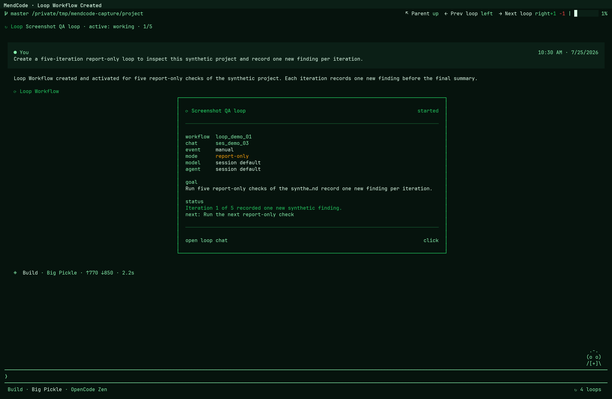
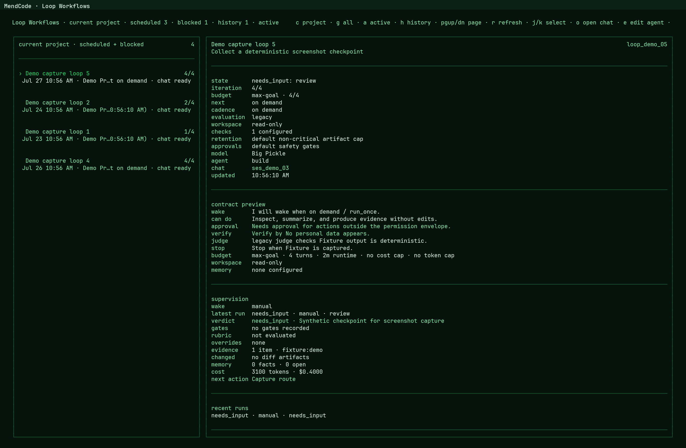

# Loop Workflows

Loop Workflows are durable, monitorable agent loops for work that should keep moving in controlled iterations. They are closer to an inspectable workflow runner than to a single long chat turn.

The design goal is simple: a user can turn an objective into a loop, see it in Agent View, inspect every wakeup, and choose how much execution power the loop gets.

For one-shot runs without recurring cadence, use the independent Workflow contract documented in [`docs/workflows.md`](workflows.md). A loop may still trigger a saved Workflow revision, but cadence, wakeups, and loop gates remain owned by the loop while `/workflows` owns the phase/task graph.





## What The Screenshots Show

The receipt view confirms that a report-only workflow has been created, shows the durable loop id, cadence, iteration limit, next wakeup, and the loop card that can be opened from chat.

The dashboard view shows the active loop list, current iteration progress, next wakeup, execution mode, linked root session, and a bounded summary of the latest run, gates, evidence, cost, and next action. It is the persistent monitor surface for checking whether a loop is sleeping, running, paused, or ready for inspection.

## Mental Model

A loop has six layers:

- Workflow: the durable DB record with objective, state, trigger, gates, policy, metrics, and next wakeup.
- Root session: the chat session created when the loop is activated. It is the root loop turn, appears in Agent View as a background looping session, and is the only row currently recorded in the loop thread ledger.
- Optional child sessions: normal task/subagent sessions created by edit-capable root turns, plus a separate report-only evaluator child when independent judgment is required. They remain session transcripts rather than additional Agent View loop roots or loop-thread rows.
- Run: one wakeup/iteration of the loop.
- Artifact ledger: bounded checkpoints, judgments, gate results, command output, evidence, signals, overrides, and cost records associated with the workflow or a run.
- Journal: durable events such as created, activated, wake, started, completed, failed, paused, resumed, and stopped.

The DB remembers the workflow even when MendCode exits. A live process is still required to wake due loops.

## Choose The Loop Shape

Completion policy and wakeup policy are independent. Choose the budget mode
from how the work should finish, then choose a trigger from when it should run:

| Intent | Budget contract | Trigger contract | Completion behavior |
|---|---|---|---|
| Reach a verifiable goal | `budgetMode: "max-goal"` plus concrete `completionCriteria`, with `successChecks` when evidence must be checked | Manual, self-paced, interval, daily, adaptive, or external signal | Complete as soon as the goal passes its checks and gates. A positive `maxTurns` is an optional safety cap, not a target. |
| Run a recurring job | `budgetMode: "unbounded-monitor"`; omit `maxTurns` | Usually interval, daily, adaptive, or external signal | Keep running the objective at each wakeup until explicitly stopped or blocked by a safety, budget, approval, or input gate. |
| Run an exact number of iterations | `budgetMode: "fixed"` plus a positive `maxTurns` | Manual or scheduled | Consume the requested iteration count unless stopped or blocked. |

Every loop has an objective. For `max-goal`, the objective and completion
criteria describe a result that can be verified once. For a recurring job, the
objective describes what to inspect or perform at every wakeup; a successful run
does not make the ongoing schedule complete. Do not divide goal work across all
available turns just because a cap exists, and never encode unlimited work as
`maxTurns: 0`.

## Supervised Completion

Loop Engineering separates proposing completion from accepting it:

1. The root loop session ends an executed iteration with a structured `LOOP_CHECKPOINT` containing status, summary, evidence, next action, and confidence.
2. Pre-judge gates inspect checkpoint validity and approval policy, then run any allowlisted executable validation commands and retain their bounded evidence.
3. When independent evaluation is required, a child evaluator sees the checkpoint plus those deterministic gates and returns a `LOOP_JUDGMENT`.
4. Post-judge gates check evidence-only `successChecks` and evaluator status, followed by deterministic rubric coverage and cost policy.
5. The gate engine atomically records the run/workflow/artifacts and computes the next workflow state. A root worker or judge cannot bypass failed policy, approval, validation, success-check, rubric, or cost gates.

The three budget modes have different completion semantics:

| Mode | Operator expectation |
|---|---|
| `fixed` | Run to the positive iteration cap unless stopped, blocked, or waiting for input; it does not complete early when the goal is reached. |
| `max-goal` | Treat `maxTurns` as a cap, finish early as soon as completion is verified, and block instead of claiming success when the cap is exhausted. |
| `unbounded-monitor` | Keep monitoring until stopped, an explicit safety/budget/input gate blocks it, or an external stop condition applies; omit `maxTurns`. A scheduled monitor may report an informational `blocked` checkpoint (for example, stale data) and keep its next wakeup when no gate failed. |

`max-goal` workflows created through the loop tool default to independent evaluation unless the contract explicitly selects another mode. A passing independent evaluator may close an already-complete goal when the worker reported `blocked`, but only when the remaining gates pass. It does not override `needs_input`, approval requirements, or deterministic failures.

Configured `successChecks` remain backward-compatible completion evidence requirements even when executable checks also exist. Explicit `validationCommands` are different: for edit-capable workflows, the runner executes only allowlisted test/check commands as direct bounded subprocesses after a `complete` or `blocked` checkpoint that may be independently verified, and before independent judgment. An active worktree lease supplies the validation working directory. A result recorded while the run still owns its lease becomes a `command-output` artifact and a deterministic `validation:<id>` gate carrying the artifact reference; a stale-run race is discarded and blocks completion instead of attaching stale evidence. Report-only/read-only contracts, shell composition, redirection, command substitution, unsafe `git diff` output flags, and commands outside the validation allowlist are blocked as policy failures.

When a rubric is configured, the runner records deterministic evidence-coverage scores, threshold status, and mandatory-blocker findings in a separate runtime rubric result on the run. These binary coverage scores are not evaluator-authored criterion grades. The gate engine adds a runtime `rubric` gate, so a passing judge cannot override a failed executable validation or a detected mandatory blocker.

## Basic Flow

List built-in loop examples:

```bash
mendcode loops examples
```

Create a draft from a template:

```bash
mendcode loops draft --template research-digest --name "Loop test"
```

Create a draft from a custom objective:

```bash
mendcode loops draft --name "CI repair" --objective "Keep checking CI and propose fixes until the branch is green."
```

Activate the workflow:

```bash
mendcode loops activate loop_...
```

Activation creates a root session named `Loop: <name>`, registers it in Agent View as a background loop, records the root loop thread, and schedules the first wakeup.

Activation also attempts to ensure the project loop service is installed and started. Use `--no-service` only for admin/debug flows where you explicitly do not want OS-backed wakeups.

Inspect it:

```bash
mendcode loops status
mendcode loops show loop_...
mendcode loops tail loop_...
mendcode loops monitor loop_...
```

`monitor` is the terminal view for one loop. It refreshes the workflow state, persisted root-thread ledger, and journal while the command is running. Ordinary subagent and evaluator output remains in the associated session transcripts.

## Tick Modes

Daily schedules are first-class triggers rather than 24-hour intervals. Create one with `triggerMode: "daily"`, `dailyAt: "10:00"`, and a timezone such as `UTC`, `GMT`, `America/New_York`, or `Europe/Madrid`. MendCode accepts valid IANA/UTC/GMT zones, persists the timezone, calculates the next wall-clock occurrence (including daylight-saving transitions), and lets the project loop service process the workflow when that wakeup is due.

The persisted `nextWakeup` is the scheduling source of truth. The project
service scans a bounded set of due workflows, repairs overdue scheduled wakeups,
and acquires a workflow lease before execution so concurrent scheduler ticks do
not run the same workflow twice. Closing and reopening the TUI does not reset
that schedule. The `/loops` countdown is reactive presentation derived from the
persisted timestamp, not a separate timer contract.

`tick` is the manual wakeup command.

Dry-run preview:

```bash
mendcode loops tick loop_...
```

This does not call the agent. It only reports what would run.

Report-only execution (report-only/read-only workflows):

```bash
mendcode loops tick loop_... --execute --report-only
```

This wakes the agent in the loop root session and, when the workflow contract is already report-only/read-only, writes transcript/UI activity while omitting loop, edit, write, apply_patch, bash, task/subagent, todowrite, memory, and memory_graph tools from the model tool set. Executable validation commands are also recorded as blocked policy gates rather than spawned. If the workflow explicitly allows edits, `--report-only` does not override that contract.

Full execution:

```bash
mendcode loops tick loop_... --execute
```

This wakes the real agent with normal session/runtime permissions only when the workflow contract permits edits. A durable `read-only` or report-only workflow remains non-mutating even when the daemon or manual tick uses `--execute`.

## Daemon And Service

There are two background modes.

Terminal daemon:

```bash
mendcode loops daemon --execute --report-only
```

This keeps checking due loops while that terminal/process is alive. If you close the terminal or kill all MendCode processes, it stops. The workflow remains durable in the DB, but nothing wakes it until another daemon, service, or manual tick runs.

OS service:

```bash
mendcode loops service install
mendcode loops service start
mendcode loops service status
mendcode loops service logs
```

The service is installed per project and runs with that project as its working directory. It survives closing MendCode or the terminal because the OS owns the process. Its durable workflow state, catch-up behavior, and leases let scheduled work continue without relying on an open chat or TUI.

Backends:

- macOS: LaunchAgent under `~/Library/LaunchAgents`.
- Linux: user systemd unit under `$XDG_CONFIG_HOME/systemd/user` or `~/.config/systemd/user`.
- Windows: Task Scheduler task plus a generated command file under `%LOCALAPPDATA%\MendCode\Loops`.

If the default directories do not work on a machine, override them:

```bash
mendcode loops service start --service-dir /path/to/service-defs --log-dir /path/to/logs
```

Environment overrides are also supported:

```bash
MENDCODE_LOOP_SERVICE_DIR=/path/to/service-defs
MENDCODE_LOOP_LOG_DIR=/path/to/logs
```

Project config can set the same defaults in `.mendcode/mendcode.json`:

```jsonc
{
  "loop": {
    "serviceDir": "/path/to/service-defs",
    "logDir": "/path/to/logs",
    "defaultServiceMode": "report-only"
  }
}
```

`defaultServiceMode` accepts `dry-run`, `report-only`, or `execute`. Keep `report-only` for normal team defaults.

The service defaults to a report-only runner request:

```bash
mendcode loops service start
```

This runs the loop daemon in report-only mode under the default project service config. Report-only tool suppression still depends on the workflow contract: read-only/report-only workflows stay non-mutating, while edit-capable workflows can receive normal tools.

Other service modes:

```bash
mendcode loops service start --dry-run
mendcode loops service start --allow-edits
```

- `--dry-run`: wakes the scheduler but does not call the agent.
- default: calls the agent in report-only mode.
- `--allow-edits` / `--full`: clear the report-only gate so workflows whose contracts permit edits can run with normal tools; it does not override a durable read-only/report-only contract.

Stop or remove:

```bash
mendcode loops service stop
mendcode loops service uninstall
```

`uninstall` removes the OS service definition. It does not delete loop workflows, sessions, runs, or journal events.

In product UX, users should not need to run these commands for normal loop creation. They are the admin/debug surface. The chat/session flow should create the workflow, activate it, and ensure the project service is installed/started automatically.

## What Shows In The TUI

Agent View groups activated loop root sessions under `Looping`.

Opening a loop root session shows a loop banner in chat. A report-only tick keeps report-only/read-only workflows non-mutating while still producing transcript activity. A full execution tick behaves like a normal agent turn inside the loop root session.

Recommended UI smoke test:

```bash
mendcode loops draft --template research-digest --name "Loop test"
mendcode loops activate loop_...
mendcode loops tick loop_... --execute --report-only
mendcode
```

Then open Agent View, find the session under `Looping`, and inspect the loop banner plus transcript.

Natural session prompt example:

```text
Turn this session into a test loop. Run 5 iterations, inspect the main files in this directory, use analysis subagents when useful, do not edit files, and after each iteration report what is new or different from the previous iteration. When the loop finishes, give me a final summary.
```

Expected product behavior:

1. The agent creates a loop draft from the current session/objective.
2. The agent activates the loop and creates the root loop session.
3. MendCode ensures the project service is installed and started.
4. The root session appears in Agent View under `Looping`.
5. Each iteration writes transcript/journal updates.
6. If the TUI is open, SSE events refresh the view live. If the TUI was closed, reopening MendCode hydrates from durable DB state and shows the latest loop state.

### `/loops` operator dashboard

The `/loops` route separates active workflows from history and refreshes from loop events with a polling fallback. The detail view exposes a bounded summary of the objective, contract preview, state/phase, wake reason, latest run, checkpoint/judgment verdict, executable check labels/counts, rubric result, override audit count, retention policy, evidence summary, loop memory, cost, and next action when those fields exist. Scheduled workflows show a live countdown to persisted `nextWakeup` plus scheduler state; the countdown updates without mutating the workflow record.

Keyboard controls:

| Key | Action |
|---|---|
| `a` / `h` | Switch between active workflows and history. |
| `j` / `k` or arrows | Select the next or previous workflow. |
| `Enter` or `o` | Open the root loop chat when it exists. |
| `e` | Change the workflow agent/profile. Blank returns to the default agent. |
| `p` / `u` | Pause or resume the selected workflow. |
| `s` | Stop the selected workflow after confirmation. |
| `r` | Refresh immediately. |
| `q` or `Esc` | Return to the previous route. |

Use the state and phase together when diagnosing a workflow:

| State | Meaning |
|---|---|
| `draft` | Stored but inert; activation has not created/scheduled the root run context. |
| `active` / `sleeping` | Eligible to run now or waiting for its trigger. |
| `working` | A run currently owns the workflow lease. |
| `needs_input` | A user decision, permission, or gated input is required. The wait is durable; resolving it resumes the same run rather than completing, failing, or recreating the workflow. |
| `blocked` | A policy, budget, quality, environment, or other blocker prevents progress. |
| `paused` | Temporarily disabled but resumable. |
| `completed` | The completion contract passed. |
| `failed` / `stopped` | Terminal failure or explicit stop. |

The raw loop chat remains the source of truth for full model/tool output. Dashboard summaries are intentionally bounded operator views.

## Tool And API Controls

The assistant-facing `loop` tool currently supports these actions:

- Lifecycle: `draft`, `activate`, `pause`, `resume`, `stop`, and `delete`.
- Inspection: `show` and `list`.
- Execution: `run_once` records a monitor iteration without invoking the agent. It still consumes iteration budget and can block a `max-goal` workflow when the cap is exhausted.
- Configuration: `update_agent` retargets future wakeups to another agent/profile.
- Events: `signal` records a normalized external signal with source, type, dedupe key, safe payload summary, and optional links.
- Human control: `override` can retry, waive a non-critical gate, or accept completion only after an explicit user decision and reason. Every action records the actor, reason, state transition, event, and immutable override artifact.

`signal` is idempotent for the same source/type/dedupe key. Signals received while a matching workflow is working or paused remain queued for the next eligible wakeup. Authenticated HTTP ingress is also available at `POST /loop/signal`. The endpoint requires a concrete `workflowID`, is disabled unless server authentication is configured, uses the same normalized signal model, and returns `429` when its durable source rate limit is exceeded. Basic Auth establishes the local operator boundary; it does not provide per-connector signatures or cryptographic sender identity.

Local instance routes currently expose the read/control surface under `/loop`, including list, summary, snapshot, events, authenticated signal ingress, pause, resume, agent update, run-once, authenticated override, stop, and delete operations. The legacy instance router additionally exposes draft and activate creation endpoints. The experimental Effect HttpApi route does not currently expose those two creation endpoints, so automation should not assume creation-route parity yet.

Examples of read/control routes:

```text
GET    /loop
GET    /loop/summary
GET    /loop/:loopID
GET    /loop/:loopID/summary
GET    /loop/:loopID/events
POST   /loop/signal
POST   /loop/:loopID/pause
POST   /loop/:loopID/resume
POST   /loop/:loopID/agent
POST   /loop/:loopID/run-once
POST   /loop/:loopID/override
POST   /loop/:loopID/stop
DELETE /loop/:loopID
```

The legacy router additionally exposes creation endpoints that are not present in the Effect route stack:

```text
POST   /loop/draft
POST   /loop/:loopID/activate
```

Treat these as local project/instance APIs. Use the public `mendcode loops ...` CLI or the loop tool for normal operator workflows.

## Migration And Backward Compatibility

The Loop Engineering upgrade is additive. Existing workflow records do not need to be rewritten before MendCode can read them:

- Workflow, run, event, thread, and artifact data live in separate loop tables. The artifact ledger is added without replacing workflow/run records.
- New supervision fields are optional JSON data. Missing evaluation metadata renders as `legacy`; missing workspace metadata behaves as `in-place`; absent success checks, memory, cost, judgment, gate, or artifact data render with safe empty/default views.
- Validation plans, runtime rubric results, gate waivers, and artifact retention limits are optional JSON fields. Legacy workflows keep evidence-string success checks and the existing count-based artifact cap.
- Legacy report-only workflows are inferred from their gates/approval policy even when they predate explicit `workspace.mode = read-only` metadata.
- Owner/root/run/artifact session references are nullable where appropriate, so deleting or losing a linked session does not make the durable workflow unreadable.
- Existing checkpoints continue to work. Independent evaluation is required only when the compiled workflow contract enables it.

Migration does not weaken current validation:

- New `fixed` workflows require a positive `maxTurns` cap. A `max-goal` workflow may use a positive safety cap or omit `maxTurns` when no iteration cap is configured.
- `unbounded-monitor` omits `maxTurns`; never encode unlimited work as `maxTurns: 0`.
- A legacy row containing `maxTurns: 0` is shown as invalid in `/loops`; recreate the workflow with a positive cap or an unbounded monitor contract.
- Runtime defaults are application behavior, not database column defaults. Backups and migration tools should preserve the full loop JSON payload instead of reconstructing it from only top-level columns.

## Current Limits

- `maxRuntimeMs` sizes the run lease; it is not a hard wall-clock cancellation of the model process.
- `maxChildren` and `maxDepth` are persisted contract fields but are not currently enforced by a runtime consumer.
- Only the root loop session is registered in the loop thread ledger and Agent View `Looping` group; child task/evaluator sessions remain ordinary session transcripts.
- HTTP signal authentication protects the operator endpoint but does not verify connector-specific signatures.
- The artifact schema supports `diff` and `memory` kinds, but current core writers do not emit them; changed-file summaries are derived separately from the root session diff.

After upgrading, operators should:

1. Open `/loops` and confirm legacy workflows render without errors.
2. Inspect each editable `max-goal` workflow and decide whether to add explicit completion criteria, success checks, independent evaluation, workspace isolation, and approval requirements.
3. Recreate any invalid zero-budget workflow rather than relying on historical `0 = unlimited` assumptions.
4. For a report-only/read-only workflow, run the first post-upgrade wakeup with `--report-only` and inspect its checkpoint, artifacts, gates, and next action.
5. Inspect an edit-capable workflow's compiled contract before executing it; `--report-only` does not downgrade a contract that explicitly allows edits.

## Built-In Examples

Current built-in templates:

- `pr-watch`: monitor a PR and surface review or CI changes.
- `ci-repair`: keep checking failing CI and propose safe repairs.
- `research-digest`: periodically inspect a topic and summarize changes.
- `repo-maintenance`: review stale work and propose maintenance steps.

Templates create draft workflows. They do not start running until activated.

## Packages And Team Sharing

Loop templates are currently built into the runtime. The package system can already distribute commands, skills, agents, modes, prompts, permissions, model policy, memory defaults, TUI profile, and widgets. Package-distributed loop templates are a natural next step, but they are not yet part of the public package contract.

Installing one runtime package does not have to erase another package. MendCode packages are selected/enabled as runtime overlays. Conflicts are resolved by the package runtime projection rather than by blindly replacing the user's local files. Teams should still document package precedence and avoid shipping secrets or machine-local loop state.

## Safety Rules

- Drafts are inert until activated.
- `tick` without `--execute` is dry-run only.
- `--execute --report-only` keeps report-only/read-only workflows non-mutating, but it does not override an edit-capable contract.
- `--execute` allows normal runtime permissions only when the durable workflow contract permits them.
- Service requests report-only execution by default, but an explicitly edit-capable workflow contract remains authoritative.
- Human gates should remain required for push, merge, release, external sends, destructive shell actions, and other irreversible work. A judge verdict never grants permission to bypass them.
- Human override cannot waive approval, policy, budget, or required-user-input gates. Non-critical waivers and accepted completions remain visible in the run, artifact ledger, journal, loop tool output, and `/loops` supervision metadata.
- Artifact retention applies count, age, and estimated-byte budgets to non-critical evidence when an artifact append triggers pruning. Dormant workflows are not swept periodically. The latest checkpoint, judgment, blocking gate, override records, active-run command output, and validation output referenced by a retained gate remain audit-protected, so configured limits are intentionally soft while those records exist.
- Approval detection in loop completion is a completion heuristic based on the compiled policy and reported action/evidence text. It complements, but does not replace, runtime permission enforcement and human review.
- Loops are project-scoped; install/start the service from the repo that owns the workflows.
- Normal users should create loops from chat/session intent. CLI commands remain for inspection, debugging, and automation.

## Troubleshooting

No loops run:

```bash
mendcode loops status
mendcode loops tick --limit 1
```

If the workflow is durable but no process is alive, start a daemon or service.

Service installed but not waking:

```bash
mendcode loops service status
mendcode loops service logs --lines 120
```

If the service is not loaded, run:

```bash
mendcode loops service restart
```

For temporary debugging, prefer the foreground daemon:

```bash
mendcode loops daemon --execute --report-only
```

That prints every scheduler pass directly in the terminal.
