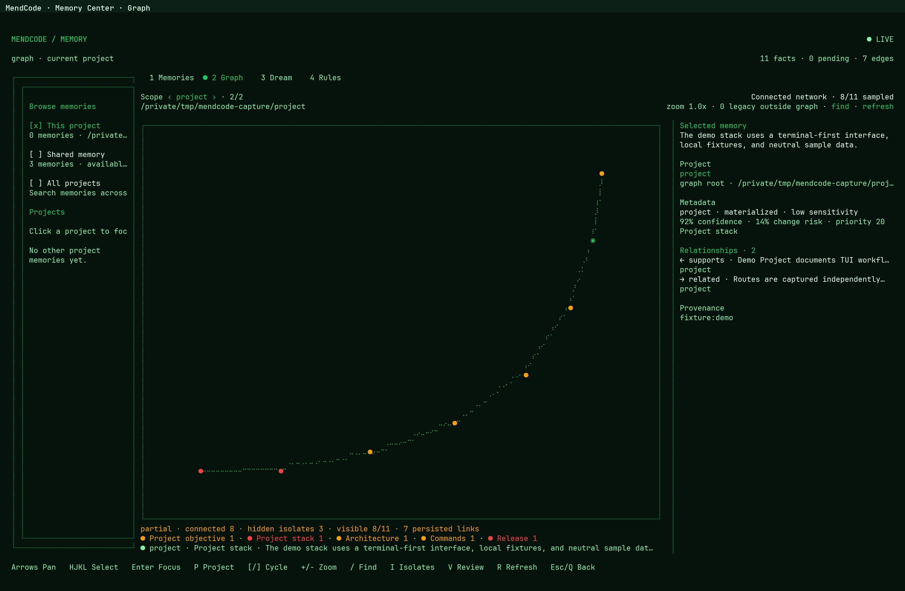

# Memory Center

Memory Center is the terminal workspace for reviewing what MendCode remembers,
what it is proposing to remember, and how that context is organized.



## What The View Shows

The overview keeps memory state visible without turning every chat into
permanent context.

| Area | Purpose |
| --- | --- |
| Project sidebar | Shows the active project and other known project memory scopes. |
| Summary cards | Separates saved memories, pending proposals, project groups, and Dream state. |
| Category graph | Shows how memories are distributed across categories such as security, commands, release, user preferences, and agent policy. |
| Pending Queue | Presents generated proposals for review before they are applied. |
| Inspector | Shows the selected proposal action, progress, and risk summary. |
| Side chat | Runs a constrained memory side agent for memory-specific questions, explanations, and draft proposals without turning the memory view into the normal coding agent. |

## Review Model

Memory is approval-first:

- saved entries are visible by scope
- generated changes enter the pending queue
- proposals can be applied, rejected, edited, or inspected
- project and global memories stay separate
- Dream state is shown as maintenance context, not as silent mutation

Generated changes can come from normal extraction, Memory Center side chat, or
Dream. They all land in the same review model: a proposal must be inspected,
edited, applied, or rejected by the user before it changes saved memory.

## Memory & Evolution (local implementation)

Setup exposes project-scoped Evolution separately from **using saved memory**.
Without explicit Evolution consent, existing legacy memory learning remains unchanged.
Adopting Evolution replaces automatic legacy extraction/Dream for that project;
it does not disable manually requested memory tools or delete saved entries.

- **Off:** blocks new capture, inference and promotion; cancels Evolution work and
  rejects late results. Previously approved artifacts remain active.
- **Observe:** retains bounded metadata only, without free text or provider calls.
- **Suggest:** authorized evidence produces review-only memory, skill and workflow
  proposals. Skills/workflows require explicit approval; saving a workflow never runs it.
- **Auto-safe (limited):** permits only an exact user correction in the form
  `Project language: TypeScript.` (also JavaScript, Python, Rust or Go), with low
  sensitivity and the project-stack category. Project memory must be empty, and
  contradictory current corrections block automatic application. Everything else,
  including permission/security/model rules, remains pending for review.

Corrections can be entered from Setup or through a chat message beginning with
`Correction:` or `Corrección:`. Optional tool/test evidence records host completion
metadata, not stdout or assistant claims. A zero process exit status is not proof
that an entire task passed a semantic audit.

Provider processing requires separate consent. Local storage **does not mean local
inference**: the selected provider may receive authorized evidence and consume quota.
Evolution uses the configured extractor/distiller role without silently switching
models. Evidence is limited to 500 records, 4 KiB per record and a 30-day eligible
window; each run uses at most five current evidence records, lasts at most 60 seconds,
and produces at most five candidates. Expired records are excluded from processing;
physical pruning occurs when the evidence ledger is next rewritten.

Daily execution uses the existing Dream service and registered workspaces. Setting a
schedule does not install or start a service. There is a five-minute admission window,
at most one claimed attempt per project/local date, and no automatic retry or late
catch-up after failure or restart. The scheduler admits at most one Evolution run per
tick. Use **Run once** for missed windows.

**Revert Evolution memories** archives an unchanged newly-created memory and retires
its graph projection without deleting graph content. An entry modified after promotion
requires manual review instead. Reversion remains available while Evolution is Off.
Capability rollback similarly checks the promoted file hash or workflow revision and
refuses to overwrite later edits.

This is contextual learning, not weight training or automatic source-code editing.
Schema validation alone does not establish the usefulness of a generated capability.

## Memory Side Agent

The side chat is intentionally constrained, but it is still powerful inside the
memory domain. It can:

- answer questions about saved global and project memories
- explain which category, scope, or policy a memory belongs to
- inspect pending proposals and summarize their risk
- draft new global/project memory proposals
- draft updates, deletions, moves, recategorization, verification, expiration,
  and policy changes
- help tune extraction behavior, prompt inclusion, save behavior, and category
  policy
- draft Dream schedule, source, or dry-run changes

The side agent should not be described as a source-editing or shell-capable
coding agent. It does not apply generated changes by itself; it prepares
reviewable memory work.

## Dream

Dream is the memory maintenance loop for manual or scheduled consolidation. It
uses the `memoryDream` model role and focuses on memory quality rather than code
execution.

Dream can surface:

- duplicated or stale memories
- memories that should move between global/project scope
- category and policy drift
- missing verification signals
- outdated project context
- proposals for add, update, remove, verify, expire, recategorize, and scope
  changes

Dream writes logs, safety context, and reviewable proposals. It should not be
documented as applying memory silently, editing source files, mutating git, or
reading arbitrary filesystem/session evidence without an explicit bounded path.

## CLI Pairing

The visual workspace complements the CLI commands:

```bash
mendcode memory status
mendcode memory list --scope global
mendcode memory list --scope project
mendcode memory search "release workflow"
mendcode memory preview "release workflow"
```

Use direct `mendcode memory add` only when the user explicitly asks to save
something. Generated memory changes should stay reviewable.
