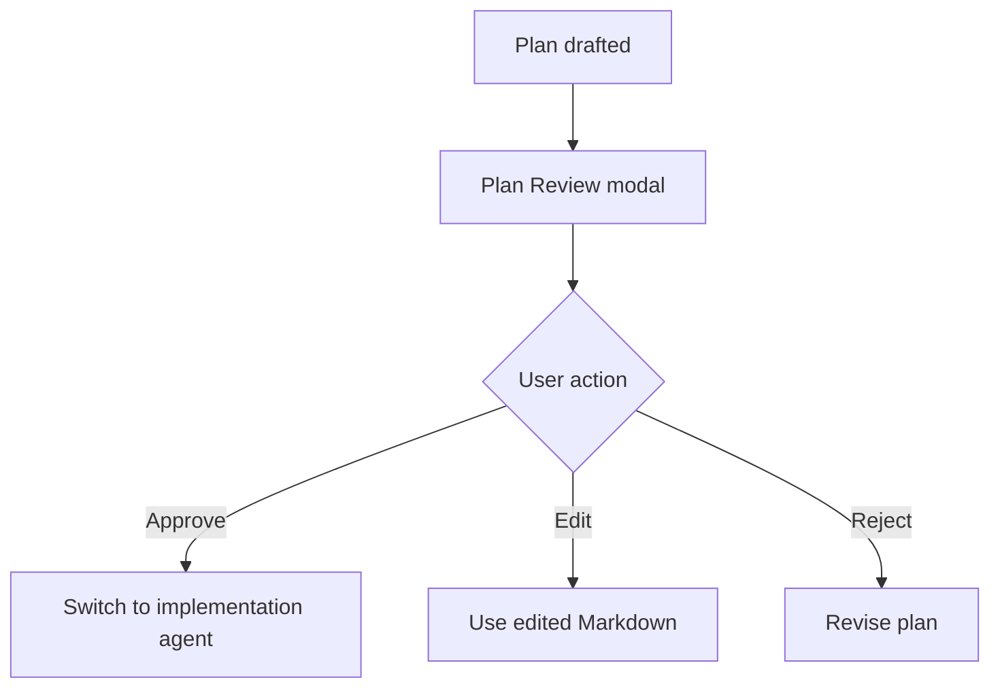

# Plan Mode

Plan Mode turns planning into an explicit review step before implementation. The agent prepares a Markdown plan, calls the `plan_review` tool, and MendCode renders that plan in an interactive TUI modal.

The important behavior is simple:

1. The plan is displayed in the terminal, not buried in normal assistant prose.
2. You can approve, edit, comment, or reject it.
3. Approval switches the session to the configured implementation agent.
4. The approved or edited Markdown becomes the source of truth for the next implementation turn.

## What The Modal Does

The `plan_review` tool accepts:

- `title`: short modal title.
- `markdown`: complete Markdown plan.

The TUI route renders the Markdown plan in a centered modal. It supports normal Markdown rendering and uses the plan Markdown renderer for terminal-friendly output. Mermaid/flowcharts are appropriate when they clarify sequencing, but the plan should still be readable as Markdown if a terminal cannot render the diagram cleanly.

Screenshot slots:

| File | Capture |
| --- | --- |
| `docs/assets/screenshots/plan-review-modal.png` | Preview stage with a concise plan and visible action hints. |
| `docs/assets/screenshots/plan-review-edit.png` | Edit or comment stage showing that the user can change the plan before implementation. |

Do not add image links until the files exist.

## Review Actions

| Action | User intent | Runtime result |
| --- | --- | --- |
| Approve | The plan is good enough to implement. | MendCode switches to the configured implementation agent and sends the approved plan as the next implementation instruction. |
| Edit | The plan is close, but the Markdown needs changes. | The edited Markdown is treated as the latest source of truth. |
| Comment | The plan is approved or edited with extra implementation notes. | Comments are appended as user implementation comments. |
| Reject | The plan should not be implemented. | The agent receives the rejection reason and should revise or explain before showing another plan. |
| Close | The modal was dismissed without a decision. | The agent should ask what needs to change before proceeding. |

The modal deliberately replaces “is this plan okay?” prose. The approval surface is the TUI modal.

## Good Plan Shape

Use a plan that is concise but execution-ready:

```markdown
# Plan: Add Package Documentation

## Context
- Public examples must use `mendcode`.
- Team packages are `.mendcode` bundles, not npm workspace packages.

## Changes
1. Update `docs/packages-and-team-sharing.md` with the package mental model.
2. Add a manifest example with commands, agents, modes, skills, prompts, MCP, widgets, TUI profile, model policy, permissions, memory, and worktree policy.
3. Add a secrets checklist.

## Verification
- Run `rg "\bmend\b" docs README.md`.
- Review links and code blocks.
```

Mermaid is useful when sequencing matters:

~~~markdown

~~~

Keep diagrams small. A plan that only works as a diagram is too fragile for terminal review.

## Post-Approval Agent

When the user approves a plan, MendCode resolves `planExitAgent` and switches the session to that implementation agent. The implementation instruction says the user approved the plan via the plan review modal, then includes the reviewed Markdown and any user comments.

Use this behavior to separate planning from writing:

- Planning agents should produce the plan and call `plan_review`.
- Implementation agents should edit files only after approval.
- If the user edits or rejects the plan, the edited Markdown or rejection reason overrides the previous draft.

## Capture Prompt

Use a demo repo with no secrets:

```text
Create a plan with a Mermaid flowchart for adding a docs page about packages. Wait for approval before editing.
```

For a cleaner screenshot, avoid huge file lists and keep the plan under one modal scroll page when possible.

## Source Map

- `src/mendcode/packages/opencode/src/tool/plan-review.ts`: tool schema, approve/edit/reject handling, and implementation-agent switch.
- `src/mendcode/packages/opencode/src/cli/cmd/tui/routes/session/plan-review.tsx`: modal UI, preview/edit/comment/reject stages, keyboard handling, and Markdown rendering.
- `src/mendcode/packages/opencode/src/session/prompt/plan.txt`: agent instruction to use `plan_review` instead of asking for approval in prose.
