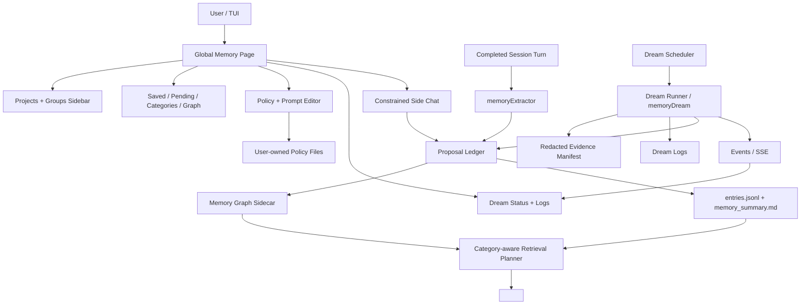

# Memory Graph, Dream, and Memory Page Spec

Status: implemented locally; focused validation passed
Target release package: `0.1.15`
Branch target: `dev`
Tracked mirror for ignored package: `.agents/specs/memory-graph-dream-page/`

## Intent

MendCode memory must evolve from a flat pending list into a durable project intelligence system. The system must distinguish global memory from project/workspace memory, remember stable project context, avoid volatile task state, support category-aware retrieval, expose a first-class Memory page, and provide safe AI-assisted maintenance through constrained side chat and Dream.

This is one complete ordered spec. The order is for safety and dependency management; it is not a plan to leave side chat, Dream, grouping, or policy ownership for an indefinite later pass.

## Release Decision

- This package targets `0.1.15`.
- Do not bump to `0.1.16` for this work.
- Public release notes must describe only behavior that is actually implemented and validated.
- No public promotion to `main` should happen until the user validates the visible Memory page locally.

## Resolved Product Decisions

| Area | Decision |
|---|---|
| Memory page scope | The Memory page is global from anywhere in MendCode. Opening it from any project shows all known projects/workspaces. |
| Project definition | A folder/root becomes a project/workspace once it has at least one MendCode session with one user message. |
| Project registry | Store project/workspace registry in user-global MendCode state, not a repo-local database. |
| Default discovery | Default to known MendCode session roots and user-selected roots; do not blind-scan the whole home directory. |
| Local grouping | A user's default local group root can be any configured workspace directory, for example `~/Code`. |
| General grouping | Users can configure roots/groups in their global MendCode state. |
| Group views | Support automatic folder/root groups and manual user-defined groups. Group views aggregate read/review surfaces without merging ownership scopes. |
| Scope default | Project/repo/product facts default to `project`; global is only for explicit cross-project or person-level preferences. |
| Auto-apply default | Generated memory stays pending by default. Per-category auto-apply exists only after explicit user configuration. |
| Dream role | Dream uses a new `memoryDream` role/model. |
| Dream missed windows | If the PC/process was off during the window, mark missed and wait for manual trigger. Do not auto-catch-up at startup. |
| Side chat | Included in this system. It is a constrained side-chat runtime, not a normal build/default session. |
| Side chat model | Use a dedicated constrained memory/setup assistant role by default, with user-configurable role/model override. |
| Tracked spec | This document is the tracked handoff because `.agents/` is ignored by git. |

## Non-Negotiables

- Preserve existing memory behavior through compatibility bridges.
- Do not silently write generated memory.
- Do not let a model decide arbitrary global scope without runtime validation.
- Do not grant Dream filesystem, git, or session reads by default.
- Do not let side chat become a shell/source-editing/coding agent.
- Do not show fake optimistic state in UI; labels must reflect persisted/runtime truth.
- Do not store volatile current-task state as durable memory.

## Existing System Anchors

These are the first files to map before implementation:

- `src/mendcode/packages/opencode/src/mend/memory/config.ts`
- `src/mendcode/packages/opencode/src/mend/memory/store.ts`
- `src/mendcode/packages/opencode/src/mend/memory/retrieve.ts`
- `src/mendcode/packages/opencode/src/mend/memory/proposals.ts`
- `src/mendcode/packages/opencode/src/session/processor.ts`
- `src/mendcode/packages/opencode/src/session/llm.ts`
- `src/mendcode/packages/opencode/src/cli/cmd/tui/context/route.tsx`
- `src/mendcode/packages/opencode/src/cli/cmd/tui/app.tsx`
- `src/mendcode/packages/opencode/src/cli/cmd/tui/routes/setup/index.tsx`
- `src/mendcode/packages/opencode/src/cli/cmd/tui/routes/stats/index.tsx`
- `src/mendcode/packages/opencode/src/server/routes/global.ts`
- `src/mendcode/packages/opencode/src/session/status.ts`

## Target Architecture

## Data Model

### Workspace Registry

Each workspace/project record should include:

- stable id
- root path
- display name
- first user-message timestamp
- last active timestamp
- optional git root
- optional repo fingerprint
- optional worktree path
- source: current session, historical session, user-added root, imported root
- group ids
- visibility/archive flag

Workspace ids should be stable across common path changes when git fingerprint is available, but path/root must remain visible because users reason about folders.

### Memory Fact

Each memory fact should include:

- id
- scope: `global`, `project`, `workspace`, or `group-view`
- owner workspace/group ids
- category ids
- text/content
- normalized summary
- provenance refs
- created/updated/verified timestamps
- confidence
- durability
- volatility/change-risk
- sensitivity
- stale/verified state
- retrieval priority
- links to related facts
- legacy materialization metadata

### Proposal

Every model-generated mutation must be a proposal:

- operation: add, update, remove, merge, split, verify, expire, recategorize, relink, demote-scope, promote-scope
- target ids when applicable
- proposed fact/category/scope
- reason
- evidence refs
- confidence
- durability
- volatility/change-risk
- policy decision
- status: pending, applied, rejected, superseded
- created by: extractor, side chat, Dream, manual

## Default Category Ontology

Start with these categories. The extractor may propose new categories, but new categories should be reviewed and carry retrieval/write policies.

| Category | Purpose | Default write policy |
|---|---|---|
| `project.objective` | Stable product purpose and goals | pending |
| `project.stack` | Frameworks, runtimes, package managers, core dependencies | pending |
| `project.architecture` | Durable module boundaries, data flow, services | pending |
| `project.commands` | Recurring commands, validation gates, release commands | pending |
| `project.release` | Versioning, changelog, branch, PR, release rules | pending |
| `project.constraints` | Permanent constraints, compatibility promises, ownership rules | pending |
| `project.security` | Security posture, secret handling, permission rules | pending |
| `user.preferences` | Cross-project user communication and workflow preferences | pending |
| `agent.policy` | How MendCode should behave for this user/project | pending |
| `memory.policy` | Memory save/retrieve/category rules | pending |
| `todo.stable` | Durable roadmap or recurring future work, not current task status | pending |
| `volatile.reject` | Explicit non-save class for fast-changing facts | disabled |

## Extraction Rules

The extractor must prefer project scope for facts about:

- repo/product name
- stack/toolchain
- commands/tests
- architecture
- release flow
- local paths
- project-specific constraints
- current workspace behavior

The extractor may use global scope for:

- communication preferences
- cross-repo work habits
- user-level UI/answer preferences
- policies explicitly stated as universal

Do not persist:

- current bug status
- temporary task progress
- raw logs
- one-off command output
- unverified stack traces
- rapidly changing code state
- details useful only for the current chat

## Memory Page

The Memory page should be route-level, not just a modal. It needs:

- global/project/group sidebar
- current project selection
- automatic and manual groups
- saved memories view
- pending proposals view
- category/policy editor
- graph/links view
- Dream status and logs
- side chat panel
- item inspector with provenance and actions

Responsive behavior:

- wide terminal: sidebar, main view, inspector, side chat/Dream panel
- medium terminal: sidebar + main, inspector as focus/detail view
- narrow terminal: single-column navigation with stable rows and no overlapping text
- tiny stacked terminal: command-list layout with deterministic focus movement

## Side Chat

Side chat is a reusable constrained runtime for Memory and Setup assistance.

It must support:

- simple user/assistant history
- scrollback
- stop/cancel via Escape or explicit control
- copy message
- plain text rendering by default
- no requirement to render assistant markdown richly
- compact context building
- selected workspace/group/category/policy context

It must not support by default:

- shell commands
- source edits
- git mutations
- normal session mode switching
- arbitrary tools
- silent memory/config writes

Side-chat model output should be action-oriented:

- propose memory mutation
- propose category/policy change
- explain current memory state
- draft Dream dry-run plan
- summarize conflicts/staleness

All mutations become reviewable proposals or explicit UI actions.

## Dream

Dream is a background/manual consolidation process powered by `memoryDream`.

Default reads:

- saved memory
- pending/applied/rejected proposals
- prior Dream logs
- workspace registry metadata needed to select scope

Opt-in reads:

- session metadata
- session summaries/content
- git metadata
- filesystem metadata/content

Dream writes:

- append-only run logs
- redacted evidence manifest
- safety report
- reviewable proposals

Dream must not:

- apply memory directly by default
- edit source files
- mutate git state
- write config silently
- read secrets by default
- auto-catch-up missed schedules at startup

Schedule semantics:

- user configures daily time window, not a fixed exact minute
- scheduler picks one slot inside the window
- at most one run per workspace/group per local date
- if the process is unavailable during the window, mark missed
- missed runs wait for manual trigger from Memory page
- manual runs use the same locks, permissions, logs, and proposal path

Allowed git reads after opt-in should start with:

- `git status --short --branch`
- `git rev-parse --show-toplevel HEAD`
- `git branch --show-current`
- `git log --oneline --decorate -n <bounded>`
- `git diff --stat`
- `git diff --name-only`

Raw diffs and file contents need stronger explicit permission.

Filesystem reads after opt-in must:

- stay inside approved roots
- exclude `.git`, `.env*`, `*.env`, caches, build outputs, binaries, archives, `node_modules`, large files, and secret-looking filenames
- prefer README/package/docs/AGENTS/context files selected by policy
- redact secrets before model input and persistent logs
- record path + hash/mtime evidence refs

## Retrieval Planner

Runtime prompt injection should include category and scope labels so the receiving model understands why a memory is present.

Priority order:

1. Active project identity and project policies
2. Current workspace architecture, stack, commands, release rules
3. Relevant group-view facts
4. Stable global user preferences
5. Stale/unverified facts only with markers or verification requirement

Category policies may disable prompt injection without deleting stored memory.

## Implementation Task Graph

### S1: Memory Contracts

- Map current memory/TUI callers and tests.
- Define category and policy contracts.
- Harden extractor prompt/schema for scope, durability, volatility, and category decisions.
- Add post-model validation that demotes likely-global mistakes and rejects volatile facts.

### S2: Storage and Workspace Graph

- Add graph sidecar with legacy bridge.
- Extend proposal ledger for update/remove/merge/split/verify/expire.
- Add workspace registry and group model.
- Add retrieval planner with category/scope labels.

### S3: Memory Page

- Add route registration and navigation.
- Build responsive Memory page shell.
- Add saved memory, proposals, categories, policies, group views, and inspector.
- Preserve old Memory Manager behavior by routing or parity.

### S4: Dream

- Add `memoryDream` role and prompts.
- Add Dream run ledger and safety/evidence manifests.
- Add manual Dream run.
- Add schedule window, locks, missed state, and no startup auto-catch-up.
- Add events/SSE/TUI state.
- Add security review for opt-in session/git/files evidence.

### S5: Side Chat and Policy Ownership

- Add constrained side-chat runtime.
- Add Memory side-chat integration.
- Add Setup side-chat adapter if the existing setup page can host it cleanly.
- Add user-owned policy/prompt files with live reload and validation.
- Add conflict/staleness/merge assistance through proposals.

### S6: Release Validation

- Run focused memory tests.
- Run TUI route/setup smoke tests.
- Run Dream scheduler/ledger tests.
- Run side-chat runtime cancellation/history tests.
- Run `git diff --check`.
- Keep version metadata at `0.1.15`.
- Update changelog with only validated behavior.

## Required Validation

Minimum focused commands should be chosen after mapping the repo, but expected coverage includes:

- memory unit tests
- proposal apply/reject/update tests
- retrieval planner tests
- workspace registry/group tests
- Dream scheduler and lock tests
- Dream safety allowlist tests
- side-chat cancellation/history tests
- TUI route/render smoke tests for wide, medium, narrow, and tiny layouts
- `git diff --check`

Repo-wide typecheck may be noisy in this checkout, so targeted tests plus diff hygiene are the safer gate unless the implementation changes shared type contracts enough to require broader validation.

## Security Review Checklist

- Treat memory, sessions, git, and files as untrusted input.
- Redact secrets before model input and logs.
- Enforce runtime allowlists outside the model.
- Make generated writes proposal-only.
- Use atomic writes or locks around graph/proposal/index mutations.
- Keep logs append-only where practical.
- Keep Dream evidence bounded.
- Do not render fake UI state.
- Do not expose side chat to arbitrary tools.

## Handoff Notes

- The ignored full spec package is in `.agents/specs/memory-graph-dream-page/`.
- This tracked doc is the handoff source another agent should read first.
- User explicitly resolved the major open questions; do not reopen them unless implementation evidence creates a real blocker.
- Preserve unrelated dirty files in the current worktree.
- Keep the release target at `0.1.15`.

## Implementation Notes

- Added category/policy contracts, graph sidecar storage, workspace registry/group views, Dream run ledger/scheduler/evidence safety helpers, constrained memory side chat, category-aware retrieval labels, and a route-level global Memory page.
- Generated memory mutations remain reviewable proposals by default.
- Dream defaults to memory/proposal/prior-run evidence only; git/files/session reads remain opt-in and bounded.
- Validation passed with focused memory, setup, session, and import-smoke checks. Public promotion remains gated on local user testing.
